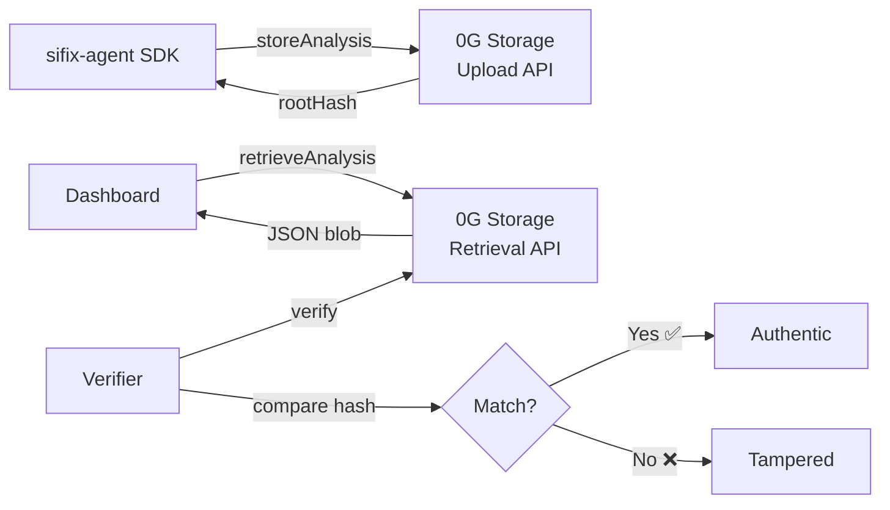

# 0G Storage API

SIFIX integrates with **0G Storage** to persist security analysis evidence immutably on-chain. Every completed scan produces a JSON blob that is uploaded to 0G Storage via the `@0gfoundation/0g-storage-ts-sdk`, returning a cryptographic **root hash** that serves as permanent, tamper-proof proof of the analysis.

All storage operations run on the **0G Galileo Testnet** (Chain ID: 16602).

---

## Overview



---

## Network Configuration

- **Storage SDK:** `@0gfoundation/0g-storage-ts-sdk`
- **RPC URL:** `https://evmrpc-testnet.0g.ai`
- **Chain ID:** `16602`
- **Network:** 0G Galileo Testnet
- **Explorer:** [https://chainscan-galileo.0g.ai](https://chainscan-galileo.0g.ai)

---

## storeAnalysis()

Uploads a security analysis result as a JSON blob to 0G Storage. Returns a **root hash** — a cryptographic commitment to the stored data that serves as immutable proof the analysis existed.

### Parameters

```typescript
interface StoreAnalysisParams {
  /** The complete analysis result to store */
  analysisResult: AnalysisResult;
  /** Optional metadata attached to the stored blob */
  metadata?: {
    /** Address of the operator/agent that performed the analysis */
    analyzedBy?: string;
    /** SDK version */
    version?: string;
    /** Custom tags for categorization */
    tags?: string[];
  };
}
```

### Usage

```typescript
import { StorageClient } from "@sifix/agent";

const storage = new StorageClient({
  rpcUrl: "https://evmrpc-testnet.0g.ai",
  chainId: 16602,
});

const rootHash = await storage.storeAnalysis({
  analysisResult: {
    simulation: {
      success: true,
      gasUsed: 52341,
      gasEstimate: 62810,
      logs: [],
      stateChanges: [
        {
          type: "tokenTransfer",
          from: "0xSender...",
          to: "0xRecipient...",
          amount: "1000000000000000000",
          token: "0xTokenAddr...",
        },
      ],
    },
    threatIntel: {
      fromAddress: null,
      toAddress: {
        address: "0xRecipient...",
        riskScore: 15,
        labels: ["verified"],
        firstSeen: "2025-06-01T00:00:00Z",
        lastSeen: "2026-05-09T00:00:00Z",
        transactionCount: 342,
        associatedEntities: [],
      },
      relatedScamDomains: [],
      knownExploitSignatures: [],
    },
    analysis: {
      riskScore: 12,
      confidence: 0.94,
      reasoning: "Standard ERC-20 transfer to a verified address with no prior threat indicators.",
      threats: [],
      recommendation: "allow",
      provider: "galileo",
    },
    timestamp: "2026-05-09T14:30:00Z",
    computeProvider: "galileo",
  },
  metadata: {
    analyzedBy: "0xOperator...",
    version: "1.5.0",
    tags: ["sifix", "evidence", "erc20-transfer"],
  },
});

console.log(rootHash);
// "0xabc123def456789..." — immutable on-chain storage root hash
```

### What Gets Stored

The analysis result and metadata are serialized to JSON and uploaded as a single blob:

```typescript
// Internal structure uploaded to 0G Storage
const storedBlob = {
  analysisResult: {
    simulation: { /* ... */ },
    threatIntel: { /* ... */ },
    analysis: { /* ... */ },
    timestamp: "2026-05-09T14:30:00Z",
    computeProvider: "galileo",
  },
  metadata: {
    analyzedBy: "0xOperator...",
    version: "1.5.0",
    tags: ["sifix", "evidence"],
    storedAt: "2026-05-09T14:30:01Z",
  },
  // Agent identity signature
  agentSignature: "0x...",
  agentTokenId: 99,
  agentContract: "0x2700F6A3e505402C9daB154C5c6ab9cAEC98EF1F",
};
```

### Returns

**`Promise<string>`** — The storage root hash (e.g. `"0xabc123def456789..."`)

This root hash is the immutable proof that the analysis existed at the time of storage. It can be:
- Included in security reports
- Shared independently for third-party verification
- Used to retrieve the full analysis via `retrieveAnalysis()`
- Embedded in on-chain transactions or attestations

---

## retrieveAnalysis()

Downloads a previously stored analysis by its root hash. The downloaded data can be verified against the root hash to confirm integrity.

### Parameters

- `rootHash` **`string`** — The storage root hash returned by `storeAnalysis()`

### Usage

```typescript
const stored = await storage.retrieveAnalysis("0xabc123def456789...");

console.log(stored.analysisResult.analysis.riskScore);   // 12
console.log(stored.analysisResult.analysis.reasoning);   // "Standard ERC-20 transfer..."
console.log(stored.analysisResult.computeProvider);      // "galileo"
console.log(stored.metadata.analyzedBy);                  // "0xOperator..."
console.log(stored.metadata.version);                     // "1.5.0"
console.log(stored.metadata.storedAt);                    // "2026-05-09T14:30:01Z"
```

### Return Type

```typescript
interface StoredAnalysis {
  /** The complete analysis result */
  analysisResult: AnalysisResult;
  /** Attached metadata */
  metadata: {
    analyzedBy?: string;
    version?: string;
    tags?: string[];
    storedAt: string;
  };
  /** Agent identity signature (ERC-7857) */
  agentSignature?: string;
  agentTokenId?: number;
  agentContract?: string;
}
```

---

## Verification Flow

Verification ensures that stored evidence has not been tampered with. Anyone can verify the integrity of a stored analysis using the root hash.

### Steps

1. **Retrieve** the root hash from a security report or the dashboard
2. **Download** the evidence data from 0G Storage via `retrieveAnalysis()`
3. **Compute** the hash of the downloaded data
4. **Compare** against the stored root hash
5. **If they match** — the evidence is authentic and unaltered

### Verification Example

```typescript
// Step 1: Known root hash from a report
const rootHash = "0xabc123def456789...";

// Step 2: Retrieve stored data
const stored = await storage.retrieveAnalysis(rootHash);

// Step 3–5: Verify using the 0G Storage SDK
import { StorageClient as ZeroGStorage } from "@0gfoundation/0g-storage-ts-sdk";

const zgStorage = new ZeroGStorage({
  rpcUrl: "https://evmrpc-testnet.0g.ai",
  chainId: 16602,
});

const isValid = await zgStorage.verify(
  rootHash,
  JSON.stringify(stored)
);

console.log("Evidence valid:", isValid); // true
```

### Verification with Agent Identity

For reports signed by the SIFIX agent, additional verification against the ERC-7857 contract is possible:

```typescript
// Verify the agent signature
const erc7857 = new Contract(
  "0x2700F6A3e505402C9daB154C5c6ab9cAEC98EF1F",
  ERC7857_ABI,
  provider
);

// Check identity is active
const identity = await erc7857.getAgentIdentity(99);
// Returns: { owner, active, attestationCount }

if (!identity.active) {
  throw new Error("Agent identity has been revoked");
}

// Verify the signature
const dataHash = keccak256(toUtf8Bytes(JSON.stringify(stored.analysisResult)));
const isValid = await erc7857.verifyAttestation({
  tokenId: stored.agentTokenId,
  dataHash,
  signature: stored.agentSignature,
});

console.log("Agent signature valid:", isValid); // true
```

---

## Explorer URL Construction

Stored analyses can be viewed through the 0G Galileo Testnet explorer. The SIFIX dashboard constructs explorer URLs from the root hash.

### URL Pattern

```
https://chainscan-galileo.0g.ai/blob/{rootHash}
```

### Construction in Code

```typescript
function getExplorerUrl(rootHash: string): string {
  return `https://chainscan-galileo.0g.ai/blob/${rootHash}`;
}

// The AnalysisResult includes the storageExplorer field
const result = await agent.analyzeTransaction({ from, to });
if (result.storageRootHash) {
  console.log("View on explorer:", result.storageExplorer);
  // https://chainscan-galileo.0g.ai/blob/0xabc123def456789...
}
```

### Dashboard Download Endpoint

The SIFIX dashboard also provides a REST API endpoint for downloading stored analyses:

```typescript
const response = await fetch(
  `https://api.sifix.io/v1/storage/${rootHash}/download`,
  { headers: { Authorization: `Bearer ${token}` } }
);

const data = await response.json();
// {
//   hash: "0xabc123def456789...",
//   analysis: { ... },
//   metadata: { analyzedBy: "0x...", version: "1.5.0" },
//   storedAt: "2026-05-09T14:30:01Z"
// }
```

---

## Retry Strategy

The `storeAnalysis()` method implements automatic retry logic to handle transient failures during on-chain storage operations.

### Retry Configuration

- **Max retries:** 3
- **Backoff strategy:** Exponential (1s, 2s, 4s)
- **Retryable errors:**
  - Network timeouts
  - RPC connection errors
  - Storage submission failures
  - Rate limit responses (429)

### Retry Behavior

```typescript
// Internal retry implementation
async function storeWithRetry(
  params: StoreAnalysisParams,
  maxRetries: number = 3
): Promise<string> {
  let lastError: Error;

  for (let attempt = 0; attempt <= maxRetries; attempt++) {
    try {
      const rootHash = await uploadToZeroGStorage(params);
      return rootHash;
    } catch (error) {
      lastError = error as Error;

      if (attempt < maxRetries) {
        const delay = Math.pow(2, attempt) * 1000; // 1s, 2s, 4s
        console.warn(
          `Storage upload failed (attempt ${attempt + 1}/${maxRetries + 1}). ` +
          `Retrying in ${delay}ms...`
        );
        await sleep(delay);
      }
    }
  }

  throw new Error(
    `Storage upload failed after ${maxRetries + 1} attempts: ${lastError.message}`
  );
}
```

### Custom Retry Configuration

```typescript
const storage = new StorageClient({
  rpcUrl: "https://evmrpc-testnet.0g.ai",
  chainId: 16602,
  retries: 5,             // Override default max retries
  retryDelay: 2000,       // Override base delay (2s, 4s, 8s, 16s, 32s)
});
```

---

## Rate Limits

0G Storage operations are subject to rate limits on the 0G Galileo Testnet. The SDK handles these gracefully.

### Storage Rate Limits

- **Upload rate:** Limited by block confirmation time (~2–3 seconds per upload)
- **Download rate:** No significant rate limiting for retrieval operations
- **Concurrent uploads:** 1 (sequential — each upload waits for confirmation)

### SDK Handling

```typescript
// The SDK automatically:
// 1. Waits for block confirmation before returning the root hash
// 2. Respects rate limit headers from the RPC
// 3. Retries on 429 responses with exponential backoff
// 4. Queues concurrent uploads sequentially
```

### REST API Rate Limits

When accessing stored analyses through the SIFIX REST API (`GET /storage/:hash/download`), standard API rate limits apply:

- **Free tier:** 30 requests/min · 1,000 requests/day
- **Pro tier:** 120 requests/min · 10,000 requests/day

---

## Mock Mode

For local development and testing, the `StorageClient` can operate in **mock mode** — skipping all on-chain interactions and returning deterministic fake data.

### Enabling Mock Mode

```typescript
const storage = new StorageClient({ mockMode: true });
```

### Mock Behavior

| Operation | Mock Behavior |
|-----------|---------------|
| `storeAnalysis()` | Returns a deterministic mock hash (`0xmock_` + SHA-256 of the analysis). No on-chain transaction. |
| `retrieveAnalysis()` | Returns the in-memory stored data. If not previously stored, returns a generated mock analysis. |

### Usage Example

```typescript
const storage = new StorageClient({ mockMode: true });

// Store — returns mock hash immediately
const hash = await storage.storeAnalysis({
  analysisResult: result,
  metadata: { analyzedBy: "0xTest...", version: "1.5.0" },
});

console.log(hash);
// "0xmock_a1b2c3d4e5f6..." — deterministic mock hash

// Retrieve — returns the stored data from memory
const retrieved = await storage.retrieveAnalysis(hash);
console.log(retrieved.metadata.version); // "1.5.0"
```

### When to Use Mock Mode

- **Unit tests** — Fast, deterministic tests without network dependencies
- **Local development** — Build and test dashboard/extension features without 0G tokens
- **CI/CD pipelines** — Run integration tests without on-chain infrastructure
- **Demos** — Showcase functionality without waiting for block confirmations

### Full Agent Mock Mode

Mock mode propagates through the entire agent pipeline when set at the agent level:

```typescript
import { SecurityAgent } from "@sifix/agent";

const agent = new SecurityAgent({
  network: {
    chainId: 16602,
    rpcUrl: "https://evmrpc-testnet.0g.ai",
  },
  storage: { mockMode: true },
  // All modules respect mock mode:
  // - TransactionSimulator: deterministic simulation results
  // - AIAnalyzer: pre-configured risk scores
  // - StorageClient: fake root hashes (no on-chain writes)
  // - ThreatIntelProvider: sample threat data
});

await agent.init();

const result = await agent.analyzeTransaction({
  from: "0xTestSender...",
  to: "0xTestRecipient...",
});

console.log(result.storageRootHash);
// "0xmock_..." — mock hash, no actual on-chain storage
```

---

## Complete Integration Example

End-to-end flow: analyze a transaction, store evidence, retrieve and verify.

```typescript
import { SecurityAgent } from "@sifix/agent";

// 1. Initialize agent
const agent = new SecurityAgent({
  network: {
    chainId: 16602,
    rpcUrl: "https://evmrpc-testnet.0g.ai",
  },
  storage: { enabled: true },
});

await agent.init();

// 2. Analyze transaction (automatically stores evidence)
const result = await agent.analyzeTransaction({
  from: "0xSender...",
  to: "0xRecipient...",
  data: "0xa9059cbb...",
  value: "1000000000000000000",
});

// 3. Check the result
console.log(`Risk: ${result.analysis.riskScore}/100`);
console.log(`Recommendation: ${result.analysis.recommendation}`);
console.log(`Provider: ${result.computeProvider}`);

// 4. Access on-chain evidence
if (result.storageRootHash) {
  console.log(`Root hash: ${result.storageRootHash}`);
  console.log(`Explorer: ${result.storageExplorer}`);

  // 5. Retrieve and verify later
  const retrieved = await storage.retrieveAnalysis(result.storageRootHash);
  console.log(`Stored at: ${retrieved.metadata.storedAt}`);
  console.log(`Agent token: ${retrieved.agentTokenId}`);
}
```

---

## Related

- [@sifix/agent SDK](./agent-sdk) — StorageClient class reference
- [REST API](./rest-api) — `GET /storage/:hash/download` endpoint
- [Extension API](./extension-api) — How the extension stores analysis evidence
