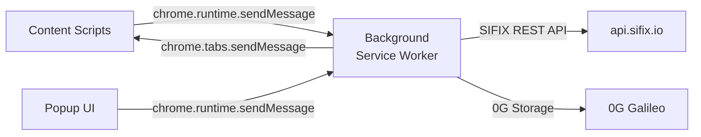

# Chrome Extension API

The SIFIX Chrome Extension (MV3) uses Chrome's **message passing API** for communication between content scripts, the popup UI, and the background service worker. This reference documents all message types, expected payloads, handler responses, and communication patterns.

---

## Architecture



All messages follow the Chrome extension message format:

```typescript
chrome.runtime.sendMessage(message: ExtensionMessage, callback?: (response) => void)
```

---

## Message Types

The extension defines **five primary message types** used across content scripts and popup communication.

```typescript
enum MessageType {
  ANALYZE_TX = "ANALYZE_TX",
  CHECK_DOMAIN = "CHECK_DOMAIN",
  GET_STATUS = "GET_STATUS",
  AUTH_CONNECT = "AUTH_CONNECT",
  AUTH_DISCONNECT = "AUTH_DISCONNECT",
}
```

---

## ANALYZE_TX

Sent by the **tx-interceptor** content script when it intercepts an `eth_sendTransaction` or signing request. The background service worker processes the transaction through the SIFIX analysis pipeline and returns a security verdict.

### Message Payload

```typescript
interface AnalyzeTxMessage {
  type: "ANALYZE_TX";
  payload: {
    /** Transaction parameters */
    transaction: {
      from: string;        // Sender address
      to: string;          // Recipient address
      data?: string;       // Calldata hex string
      value?: string;      // ETH value in wei
    };
    /** The page URL where the transaction originated */
    sourceUrl: string;
    /** The connected wallet address */
    userAddress: string;
    /** Request ID for correlating response */
    requestId: string;
  };
}
```

### Background Handler Response

```typescript
interface AnalyzeTxResponse {
  /** Whether analysis succeeded */
  success: boolean;
  /** Security verdict */
  recommendation: "allow" | "warn" | "block";
  /** Risk score 0–100 */
  riskScore: number;
  /** Human-readable explanation */
  summary: string;
  /** Detailed threat matches */
  threats: {
    type: string;
    severity: "low" | "medium" | "high" | "critical";
    description: string;
  }[];
  /** AI provider that produced the analysis */
  provider: "galileo" | "openai";
  /** 0G Storage root hash for evidence */
  storageRootHash?: string;
  /** Error message if analysis failed */
  error?: string;
}
```

### Example — Content Script → Background

```typescript
// tx-interceptor content script (MAIN world injection)
const requestId = crypto.randomUUID();

chrome.runtime.sendMessage(
  {
    type: "ANALYZE_TX",
    payload: {
      transaction: {
        from: "0xUserWallet...",
        to: "0xDestination...",
        data: "0xa9059cbb000000000000000000000000...",
        value: "1000000000000000000",
      },
      sourceUrl: window.location.href,
      userAddress: "0xUserWallet...",
      requestId,
    },
  },
  (response: AnalyzeTxResponse) => {
    if (chrome.runtime.lastError) {
      console.error("Analysis failed:", chrome.runtime.lastError);
      return;
    }

    switch (response.recommendation) {
      case "allow":
        // Proceed with the transaction
        proceedWithTransaction();
        break;
      case "warn":
        // Show warning to user
        showWarningOverlay(response.summary, response.threats);
        break;
      case "block":
        // Block the transaction entirely
        blockTransaction(response.summary);
        break;
    }
  }
);
```

### Example — Background Handler

```typescript
// background.ts (service worker)
chrome.runtime.onMessage.addListener(
  (message: AnalyzeTxMessage, sender, sendResponse) => {
    if (message.type !== "ANALYZE_TX") return false;

    handleAnalyzeTx(message.payload)
      .then(sendResponse)
      .catch((error) => {
        sendResponse({
          success: false,
          recommendation: "block",
          riskScore: 100,
          summary: `Analysis failed: ${error.message}`,
          threats: [],
          provider: "galileo",
          error: error.message,
        });
      });

    return true; // Keep message channel open for async response
  }
);

async function handleAnalyzeTx(payload: AnalyzeTxMessage["payload"]): Promise<AnalyzeTxResponse> {
  const response = await fetch("https://api.sifix.io/v1/extension/analyze", {
    method: "POST",
    headers: {
      "Content-Type": "application/json",
      Authorization: `Bearer ${await getAuthToken()}`,
    },
    body: JSON.stringify({
      url: payload.sourceUrl,
      transaction: payload.transaction,
      userAddress: payload.userAddress,
    }),
  });

  if (!response.ok) {
    throw new Error(`API returned ${response.status}`);
  }

  return response.json();
}
```

---

## CHECK_DOMAIN

Sent by the **dapp-checker** or **sifix-badge** content scripts when the user navigates to a new page, or by the popup when the user manually triggers a domain scan. The background runs the domain through the Domain Safety Pipeline and returns the verdict.

### Message Payload

```typescript
interface CheckDomainMessage {
  type: "CHECK_DOMAIN";
  payload: {
    /** The domain to check */
    domain: string;
    /** Full URL of the page */
    url: string;
    /** Whether to force a re-check (bypass cache) */
    forceRefresh?: boolean;
  };
}
```

### Background Handler Response

```typescript
interface CheckDomainResponse {
  /** The checked domain */
  domain: string;
  /** Safety verdict */
  verdict: "safe" | "caution" | "danger";
  /** Confidence level 0–1 */
  confidence: number;
  /** Brief explanation */
  summary: string;
  /** Threat details if flagged */
  threats: {
    category: string;
    description: string;
    reports: number;
  }[];
  /** Data source that produced the result */
  source: "cache" | "sifix-api" | "goplus" | "local-blacklist" | "safe-list";
  /** Whether the result came from cache */
  cached: boolean;
  /** Error message if check failed */
  error?: string;
}
```

### Example — Content Script → Background

```typescript
// dapp-checker content script
const domain = window.location.hostname;

chrome.runtime.sendMessage(
  {
    type: "CHECK_DOMAIN",
    payload: {
      domain,
      url: window.location.href,
    },
  },
  (response: CheckDomainResponse) => {
    if (chrome.runtime.lastError) {
      console.error("Domain check failed:", chrome.runtime.lastError);
      return;
    }

    switch (response.verdict) {
      case "safe":
        showVerifiedBanner();
        break;
      case "caution":
        showCautionBanner(response.summary);
        break;
      case "danger":
        showDangerBanner(response.summary, response.threats);
        break;
    }
  }
);
```

### Example — Auto Domain Scan (Background → Content)

The background service worker automatically triggers domain checks on tab updates:

```typescript
// background.ts — auto domain scan on tab update
chrome.tabs.onUpdated.addListener((tabId, changeInfo, tab) => {
  if (changeInfo.status !== "complete" || !tab.url) return;

  const domain = new URL(tab.url).hostname;

  // Skip non-HTTP pages
  if (!tab.url.startsWith("http")) return;

  checkDomain(domain, tab.url).then((response) => {
    // Push verdict to content scripts in this tab
    chrome.tabs.sendMessage(tabId, {
      type: "DOMAIN_VERDICT_UPDATE",
      payload: response,
    });
  });
});
```

---

## GET_STATUS

Sent by the **popup** or **content scripts** to query the current extension state — wallet connection, auth status, last scan result, and active protection state.

### Message Payload

```typescript
interface GetStatusMessage {
  type: "GET_STATUS";
  payload?: {
    /** Optional: request status for a specific tab */
    tabId?: number;
  };
}
```

### Background Handler Response

```typescript
interface GetStatusResponse {
  /** Whether the extension is authenticated */
  connected: boolean;
  /** Connected wallet address (null if disconnected) */
  walletAddress: string | null;
  /** Auth token validity */
  authenticated: boolean;
  /** Current domain verdict for the active tab */
  currentDomain: {
    domain: string;
    verdict: "safe" | "caution" | "danger" | "unknown";
    lastChecked: string | null;
  };
  /** Extension version */
  version: string;
  /** Whether the agent is active */
  agentActive: boolean;
  /** Number of transactions intercepted this session */
  txIntercepted: number;
  /** Number of threats detected this session */
  threatsDetected: number;
}
```

### Example — Popup → Background

```typescript
// popup.tsx
chrome.runtime.sendMessage(
  { type: "GET_STATUS" },
  (response: GetStatusResponse) => {
    if (chrome.runtime.lastError) {
      console.error("Status check failed:", chrome.runtime.lastError);
      return;
    }

    if (response.connected) {
      renderConnectedState({
        address: response.walletAddress,
        domain: response.currentDomain.domain,
        verdict: response.currentDomain.verdict,
        txIntercepted: response.txIntercepted,
        threatsDetected: response.threatsDetected,
      });
    } else {
      renderDisconnectedState();
    }
  }
);
```

### Example — Content Script → Background

```typescript
// sifix-badge content script
chrome.runtime.sendMessage(
  { type: "GET_STATUS" },
  (response: GetStatusResponse) => {
    if (response.connected) {
      updateShieldIcon(response.currentDomain.verdict);
    } else {
      showInactiveShield();
    }
  }
);
```

---

## AUTH_CONNECT

Sent by the **popup** when the user clicks "Connect Wallet" or by the **auth-bridge** content script during the SIWE authentication flow. Triggers wallet connection and JWT token acquisition.

### Message Payload

```typescript
interface AuthConnectMessage {
  type: "AUTH_CONNECT";
  payload: {
    /** Wallet address to connect */
    address: string;
  };
}
```

### Background Handler Response

```typescript
interface AuthConnectResponse {
  /** Whether authentication succeeded */
  success: boolean;
  /** Connected wallet address */
  address: string;
  /** JWT token (stored internally by background) */
  token?: string;
  /** Token expiration time */
  expiresAt?: string;
  /** SIWE nonce and message (if first step of two-phase auth) */
  siweMessage?: string;
  /** Error message if auth failed */
  error?: string;
}
```

### Example — Popup → Background (Full SIWE Flow)

```typescript
// popup.tsx — connect wallet button handler
async function connectWallet() {
  // Step 1: Request connection from background
  chrome.runtime.sendMessage(
    {
      type: "AUTH_CONNECT",
      payload: { address: walletAddress },
    },
    async (response: AuthConnectResponse) => {
      if (!response.success) {
        console.error("Auth failed:", response.error);
        return;
      }

      // Step 2: If SIWE message provided, sign it
      if (response.siweMessage) {
        const signature = await wallet.signMessage(response.siweMessage);

        // Step 3: Send signature back for verification
        chrome.runtime.sendMessage(
          {
            type: "AUTH_CONNECT",
            payload: {
              address: walletAddress,
              signature,
              message: response.siweMessage,
            },
          },
          (verifyResponse: AuthConnectResponse) => {
            if (verifyResponse.success) {
              updatePopupState("connected", verifyResponse.address);
            }
          }
        );
      }
    }
  );
}
```

### Example — Background Auth Handler

```typescript
// background.ts — auth handler
chrome.runtime.onMessage.addListener(
  (message: AuthConnectMessage, sender, sendResponse) => {
    if (message.type !== "AUTH_CONNECT") return false;

    const { address, signature, message: siweMessage } = message.payload;

    // Phase 1: Generate nonce and SIWE message
    if (!signature) {
      fetch("https://api.sifix.io/v1/auth/nonce", {
        method: "POST",
        headers: { "Content-Type": "application/json" },
        body: JSON.stringify({ address }),
      })
        .then((res) => res.json())
        .then(({ message }) => {
          sendResponse({
            success: true,
            address,
            siweMessage: message,
          });
        })
        .catch((error) => {
          sendResponse({ success: false, address, error: error.message });
        });

      return true;
    }

    // Phase 2: Verify signature
    fetch("https://api.sifix.io/v1/auth/verify", {
      method: "POST",
      headers: { "Content-Type": "application/json" },
      body: JSON.stringify({ message: siweMessage, signature }),
    })
      .then((res) => res.json())
      .then(({ token, expiresAt }) => {
        // Store token securely in extension storage
        chrome.storage.local.set({ authToken: token, walletAddress: address });

        sendResponse({
          success: true,
          address,
          token,
          expiresAt,
        });
      })
      .catch((error) => {
        sendResponse({ success: false, address, error: error.message });
      });

    return true;
  }
);
```

---

## AUTH_DISCONNECT

Sent by the **popup** when the user clicks "Disconnect" to clear the wallet connection and JWT token.

### Message Payload

```typescript
interface AuthDisconnectMessage {
  type: "AUTH_DISCONNECT";
  payload?: Record<string, never>; // No payload needed
}
```

### Background Handler Response

```typescript
interface AuthDisconnectResponse {
  /** Confirmation of disconnection */
  disconnected: boolean;
  /** The address that was disconnected */
  previousAddress?: string;
}
```

### Example — Popup → Background

```typescript
// popup.tsx — disconnect button handler
function disconnectWallet() {
  chrome.runtime.sendMessage(
    { type: "AUTH_DISCONNECT" },
    (response: AuthDisconnectResponse) => {
      if (response.disconnected) {
        updatePopupState("disconnected");
      }
    }
  );
}
```

### Example — Background Disconnect Handler

```typescript
// background.ts — disconnect handler
chrome.runtime.onMessage.addListener(
  (message: AuthDisconnectMessage, sender, sendResponse) => {
    if (message.type !== "AUTH_DISCONNECT") return false;

    chrome.storage.local.get(["walletAddress"], (result) => {
      chrome.storage.local.remove(["authToken", "walletAddress"], () => {
        sendResponse({
          disconnected: true,
          previousAddress: result.walletAddress,
        });
      });
    });

    return true;
  }
);
```

---

## Event Listeners

### Background Service Worker

The background service worker registers listeners for all message types plus tab events:

```typescript
// background.ts — unified message listener
chrome.runtime.onMessage.addListener(
  (message, sender, sendResponse) => {
    switch (message.type) {
      case "ANALYZE_TX":
        handleAnalyzeTx(message.payload).then(sendResponse);
        return true; // async

      case "CHECK_DOMAIN":
        handleCheckDomain(message.payload).then(sendResponse);
        return true; // async

      case "GET_STATUS":
        handleGetStatus(sender.tab?.id).then(sendResponse);
        return true; // async

      case "AUTH_CONNECT":
        handleAuthConnect(message.payload).then(sendResponse);
        return true; // async

      case "AUTH_DISCONNECT":
        handleAuthDisconnect().then(sendResponse);
        return true; // async

      default:
        console.warn("Unknown message type:", message.type);
        return false;
    }
  }
);

// Auto domain scan on tab navigation
chrome.tabs.onUpdated.addListener((tabId, changeInfo, tab) => {
  if (changeInfo.status === "complete" && tab.url?.startsWith("http")) {
    const domain = new URL(tab.url).hostname;
    autoCheckDomain(tabId, domain, tab.url);
  }
});

// Badge updates when tab is activated
chrome.tabs.onActivated.addListener((activeInfo) => {
  updateBadgeForTab(activeInfo.tabId);
});
```

---

## Message Validation

All messages are validated before processing. Invalid messages are rejected with a structured error.

### Validation Rules

```typescript
// Message validation utility
function validateMessage(message: unknown): message is ExtensionMessage {
  if (!message || typeof message !== "object") return false;

  const msg = message as Record<string, unknown>;

  if (typeof msg.type !== "string") return false;

  const validTypes = [
    "ANALYZE_TX",
    "CHECK_DOMAIN",
    "GET_STATUS",
    "AUTH_CONNECT",
    "AUTH_DISCONNECT",
  ];

  if (!validTypes.includes(msg.type as string)) return false;

  // Type-specific validation
  switch (msg.type) {
    case "ANALYZE_TX":
      return (
        !!msg.payload &&
        typeof (msg.payload as any).transaction?.from === "string" &&
        typeof (msg.payload as any).transaction?.to === "string" &&
        typeof (msg.payload as any).requestId === "string"
      );

    case "CHECK_DOMAIN":
      return (
        !!msg.payload &&
        typeof (msg.payload as any).domain === "string"
      );

    case "AUTH_CONNECT":
      return (
        !!msg.payload &&
        typeof (msg.payload as any).address === "string" &&
        (msg.payload as any).address.startsWith("0x")
      );

    case "GET_STATUS":
    case "AUTH_DISCONNECT":
      return true; // No payload validation needed

    default:
      return false;
  }
}

// Usage in background handler
chrome.runtime.onMessage.addListener((message, sender, sendResponse) => {
  if (!validateMessage(message)) {
    sendResponse({
      success: false,
      error: "INVALID_MESSAGE",
      message: "Message failed validation",
    });
    return false;
  }
  // ... process valid message
});
```

---

## Communication Patterns

### Content Script → Background

Content scripts (tx-interceptor, api-bridge, sifix-badge, dapp-checker, auth-bridge) send messages to the background using `chrome.runtime.sendMessage`:

```typescript
// One-way fire-and-forget with optional callback
chrome.runtime.sendMessage(message, (response) => {
  if (chrome.runtime.lastError) {
    // Handle error
    return;
  }
  // Process response
});
```

### Background → Content Script

The background service worker pushes updates to content scripts in specific tabs using `chrome.tabs.sendMessage`:

```typescript
// Push domain verdict update to all frames in a tab
chrome.tabs.sendMessage(tabId, {
  type: "DOMAIN_VERDICT_UPDATE",
  payload: domainVerdict,
});
```

### Popup → Background

The popup communicates with the background service worker using `chrome.runtime.sendMessage`:

```typescript
// Popup queries extension status on mount
useEffect(() => {
  chrome.runtime.sendMessage({ type: "GET_STATUS" }, (response) => {
    setExtensionState(response);
  });
}, []);
```

---

## Unified Message Type

All extension messages conform to a single union type:

```typescript
type ExtensionMessage =
  | AnalyzeTxMessage
  | CheckDomainMessage
  | GetStatusMessage
  | AuthConnectMessage
  | AuthDisconnectMessage;

type ExtensionResponse =
  | AnalyzeTxResponse
  | CheckDomainResponse
  | GetStatusResponse
  | AuthConnectResponse
  | AuthDisconnectResponse;
```

---

## Technical Specifications

- **Framework:** Plasmo 0.88
- **Manifest Version:** 3 (MV3)
- **Message API:** `chrome.runtime.sendMessage` / `chrome.tabs.sendMessage`
- **Content Scripts:** 5 (tx-interceptor, api-bridge, sifix-badge, dapp-checker, auth-bridge)
- **Popup Size:** 340 × 440 px
- **Target Browser:** Chrome 116+
- **Permissions:** `activeTab`, `tabs`, `storage`, `alarms`, `scripting`

---

## Related

- [@sifix/agent SDK](./agent-sdk) — The analysis engine powering extension verdicts
- [REST API](./rest-api) — Backend endpoints called by the extension
- [0G Storage API](./0g-storage-api) — Evidence storage for analysis results
