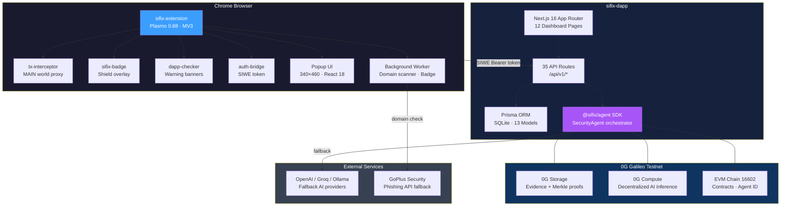
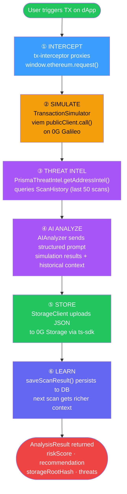
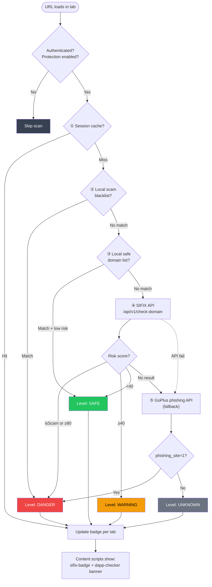
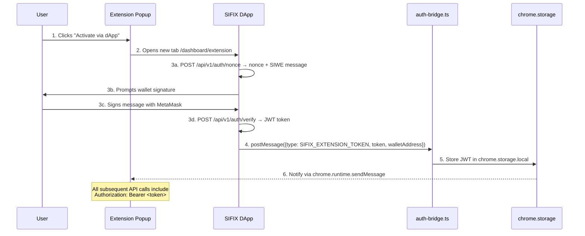

# Architecture Deep Dive

SIFIX is a three-tier AI-powered Web3 security platform built on the **0G Galileo Testnet** (Chain ID: 16602). This page covers every layer of the system — from the SDK core to the browser extension content scripts — with detailed diagrams and specifications.

---

## High-Level System Architecture



The system is composed of three repositories that form a cohesive pipeline:

- **sifix-agent** — The core SDK (`@sifix/agent` on npm). Provides the `SecurityAgent` orchestrator, `TransactionSimulator`, `AIAnalyzer`, `StorageClient`, and `ThreatIntelProvider` interface.
- **sifix-dapp** — A Next.js 16 application serving 12 dashboard pages and 35 API routes. Integrates the agent SDK, manages a Prisma SQLite database, and handles SIWE authentication for the extension.
- **sifix-extension** — A Plasmo 0.88 Chrome MV3 extension that intercepts `window.ethereum.request()` in the MAIN world, proxies analysis through the dApp API, and provides real-time domain safety scanning.

---

## Component Details

### sifix-agent SDK

The `@sifix/agent` package is the security analysis engine. It is database-agnostic — the consumer injects a `ThreatIntelProvider` implementation to supply historical context.

**Source structure:**

```
src/
├── index.ts                     # SecurityAgent class (orchestrator)
├── ai/
│   └── analyzer.ts              # AIAnalyzer — dual provider routing
├── compute/
│   └── client.ts                # ComputeClient — 0G Compute broker wrapper
├── core/
│   └── simulator.ts             # TransactionSimulator — viem-based TX simulation
├── storage/
│   ├── client.ts                # StorageClient — 0G Storage upload/download
│   └── client.spec.ts           # Unit tests for mock mode
└── threat-intel/
    └── provider.ts              # ThreatIntelProvider interface
```

**Key classes:**

- **SecurityAgent** — Top-level orchestrator. Coordinates simulation → threat intel → AI analysis → storage → persistence. Exposes `init()` and `analyzeTransaction()`.
- **TransactionSimulator** — Uses viem `publicClient.call()` against 0G Galileo to simulate transactions without broadcasting. Returns gas estimates, balance changes, emitted events, and revert reasons.
- **AIAnalyzer** — Dual-mode risk engine. Routes through **0G Compute** (decentralized) when configured, otherwise falls back to any **OpenAI-compatible API** (OpenAI, Groq, OpenRouter, Ollama, Together AI). Returns a structured `RiskAnalysis` with score, confidence, threats, and recommendation.
- **StorageClient** — Uploads analysis JSON to 0G Storage via `@0gfoundation/0g-storage-ts-sdk`. Returns a Merkle root hash and explorer URL. Supports mock mode (deterministic `keccak256` hash) for development.
- **ThreatIntelProvider** — Interface the dApp implements. `getAddressIntel()` queries historical scans; `saveScanResult()` persists results. Keeps the SDK database-agnostic.

**AI provider priority:**

1.  **0G Compute** — if `compute` config is provided (fully decentralized)
2.  **aiProvider** — if `aiProvider` config is set (OpenAI-compatible fallback)
3.  **Legacy** — if `openaiApiKey` is set (deprecated)

**Risk scoring thresholds:**

| Score Range | Risk Level | Recommendation |
|-------------|-----------|----------------|
| 0–19 | SAFE | ALLOW |
| 20–39 | LOW | ALLOW |
| 40–59 | MEDIUM | WARN |
| 60–79 | HIGH | BLOCK |
| 80–100 | CRITICAL | BLOCK |

---

### sifix-dapp

A **Next.js 16** application using the App Router pattern. Serves as both the web dashboard and the REST API backend.

**Tech stack highlights:**

- **React 19** + **Wagmi v3** + **TanStack React Query** for client state
- **Prisma 5** with **SQLite** (13 models, 30+ indexes)
- **@sifix/agent** SDK integrated server-side via `lib/threat-intel.ts`
- **Zod** for all API input validation
- **TailwindCSS 4** with pure-black glassmorphism design system

**Project structure:**

```
sifix-dapp/
├── app/
│   ├── api/                   # 35 API routes (see API Routes section)
│   └── dashboard/             # 12 pages (see Dashboard Pages section)
├── components/
│   ├── blocks/                # Landing page sections
│   ├── dashboard/             # Dashboard-specific (header, sidebar, modals)
│   ├── marketing/             # Navbar, footer, CTA
│   └── ui/                    # Shared UI (glass cards, buttons, modals)
├── config/                    # Chain, contract, endpoint, storage config
├── hooks/                     # 13 custom React hooks
├── lib/                       # Core libraries (Prisma, Wagmi, viem, API client)
└── prisma/
    ├── schema.prisma          # 13 models
    └── seed.ts                # Database seeder
```

---

### sifix-extension

A **Plasmo 0.88** Chrome Manifest V3 extension with five content scripts, a background service worker, and a popup UI.

**Content scripts:**

| Script | World | Purpose |
|--------|-------|---------|
| `tx-interceptor` | MAIN | Proxies `window.ethereum.request()` to intercept TX/sign methods |
| `api-bridge` | ISOLATED | Bridges MAIN world ↔ dApp API via `chrome.storage` + `fetch` |
| `sifix-badge` | Overlay | Floating shield chip showing real-time safety status |
| `dapp-checker` | Overlay | Warning banners on dangerous/suspicious dApp pages |
| `auth-bridge` | ISOLATED | Receives SIWE JWT from dApp via `postMessage` |

**Background service worker responsibilities:**

- Domain safety scanner (multi-layer check on every tab navigation)
- Badge updater (per-tab icon: safe/warn/risk)
- Message handler (popup ↔ content script coordination)
- Wallet state management
- Settings manager

**Local storage:**

- **chrome.storage.local** — Auth token, settings, wallet state
- **Dexie IndexedDB** — Transaction history, community tags cache

**Early injection:** `static/tx-interceptor.js` is injected at `webNavigation.onBeforeNavigate` via `chrome.scripting.executeScript` with `injectImmediately: true` and `world: "MAIN"` — ensuring the proxy is in place **before** any page scripts run.

---

## Data Flow: Transaction Analysis Pipeline

Every transaction the extension intercepts follows this six-step pipeline:



**Step-by-step:**

**① INTERCEPT** — The `tx-interceptor` content script, running in the MAIN world, has already replaced `window.ethereum.request()` with a Proxy. When the dApp calls `eth_sendTransaction`, `personal_sign`, `eth_signTypedData`, or any of 9 intercepted methods, the proxy captures the request parameters.

**② SIMULATE** — Transaction parameters (`from`, `to`, `data`, `value`) are sent to `POST /api/v1/extension/analyze`. The dApp creates a `TransactionSimulator` which uses viem's `publicClient.call()` against the 0G Galileo RPC (`https://evmrpc-testnet.0g.ai`). This simulates the transaction against current chain state without broadcasting.

**③ THREAT INTEL** — The `PrismaThreatIntel.getAddressIntel()` implementation queries the `ScanHistory` table for the last 50 scans involving the target address. It aggregates `totalScans`, `avgRiskScore`, `maxRiskScore`, `knownThreats`, `riskDistribution`, and `recentScans` into an `AddressThreatIntel` object.

**④ AI ANALYZE** — `AIAnalyzer.analyze()` constructs a structured prompt containing the simulation results and threat intelligence context. If 0G Compute is configured, the request routes through the decentralized compute network. Otherwise, it falls back to the configured OpenAI-compatible provider. The AI returns a `RiskAnalysis` with `riskScore` (0–100), `confidence`, `reasoning`, `threats[]`, and `recommendation` (ALLOW/WARN/BLOCK).

**⑤ STORE** — `StorageClient.storeAnalysis()` serializes the full analysis into JSON and uploads it to 0G Storage via `@0gfoundation/0g-storage-ts-sdk`. The upload generates a Merkle tree, and the root hash is stored on-chain. The method returns `{ rootHash, explorerUrl }` with 3 retries and exponential backoff (2s, 4s delays).

**⑥ LEARN** — `ThreatIntelProvider.saveScanResult()` persists the complete scan result to the `ScanHistory` table in SQLite. On the next scan involving the same address, step ③ will return richer context — creating a self-improving feedback loop.

---

## Extension Domain Safety Pipeline

Every tab navigation triggers a multi-layer domain safety check in the background service worker:



**Layer details:**

- **① Session cache** — Per-tab, per-session in-memory cache. Avoids redundant checks within the same browsing session.
- **② Local scam blacklist** — Hardcoded list of known scam domains in `src/constants/index.ts`. Instant DANGER match, no network call.
- **③ Local safe domain list** — Known-legitimate domains (e.g., `app.uniswap.org`). Instant SAFE if risk is low.
- **④ SIFIX API** — Calls `GET /api/v1/check-domain?domain=...` which queries the `ScamDomain` table and runs risk analysis. Returns `isScam` boolean + `riskScore`.
- **⑤ GoPlus fallback** — If the SIFIX API fails or returns no result, falls back to the GoPlus Security phishing detection API as a last resort.

---

## SIWE Authentication Flow

The extension authenticates with the dApp via Sign-In with Ethereum (SIWE):



**Token lifecycle:**

- JWT is generated by the dApp with an expiry timestamp
- Stored in `chrome.storage.local` by `auth-bridge.ts`
- Included as `Authorization: Bearer <token>` on all extension API calls
- Validated server-side on every request via `/api/v1/auth/verify-token`
- Session tracked in the `ExtensionSession` Prisma model

---

## Prisma Data Models (13)

The SQLite database uses 13 Prisma models organized into three domains:

### Core Models

- **Address** — Tracked blockchain addresses with `riskScore` (0–100), `riskLevel` (LOW/MEDIUM/HIGH/CRITICAL), `addressType` (EOA/SMART_CONTRACT/PROXY), `totalReports`, and timestamps. Indexed on risk score, risk level, and chain. Relations: `ThreatReport[]`, `TransactionScan[]`, `ReputationScore?`, `AddressTag[]`.

- **ThreatReport** — Community-reported threats with `threatType`, `severity` (0–100), `evidenceHash` (0G Storage hash), AI-generated `explanation`, `confidence`, `simulationData` (JSON), and verification workflow (`PENDING` → `VERIFIED`/`REJECTED`/`DISPUTED`). Indexed on address, reporter, type, status, and date.

- **TransactionScan** — Individual scan results with simulation data (`gasUsed`, `stateChanges` JSON), AI analysis (`riskScore`, `recommendation` as APPROVE/REJECT/WARN, `explanation`, `detectedThreats` JSON), and metadata (`scanDuration`, `agentVersion`).

- **ReputationScore** — Per-address reputation: `overallScore`, `reporterScore`, `accuracyScore` (all 0–100). Tracks `reportsSubmitted`, `reportsVerified`, `reportsRejected`. Optional `onchainReputation` from smart contract.

### System Models

- **UserProfile** — User statistics (`scansPerformed`, `threatsDetected`, `reportsSubmitted`) and notification preferences (`autoReport`, `notifyOnThreat`).

- **SearchHistory** — Historical search queries with `searchType` (address/transaction), `riskScore`, `riskLevel`, and JSON `result` snapshot.

- **SyncLog** — Synchronization audit log. Tracks `source` (0g-storage/contract), `status` (success/failed), record counts, and timing.

- **ScamDomain** — Blacklisted domains with `category` (PHISHING/MALWARE/SCAM/RUGPULL/FAKE_AIRDROP), `riskScore`, `source` (COMMUNITY/AUTOMATED/MANUAL/GOPUS), and `isActive` flag.

- **ScanHistory** — Detailed scan records with `fromAddress`, `toAddress`, `riskScore`, `riskLevel`, `recommendation` (BLOCK/WARN/ALLOW), `reasoning`, `threats` (JSON), `confidence`, and `rootHash` (0G Storage reference). This is the primary model queried by `ThreatIntelProvider.getAddressIntel()`.

### User Settings Models

- **UserSettings** — Per-address AI provider configuration. `aiProvider` values: `default`, `openai`, `groq`, `0g-compute`, `ollama`, `custom`. Stores optional `aiApiKey`, `aiBaseUrl`, `aiModel`.

- **ExtensionSession** — Browser extension JWT sessions with `walletAddress`, `token` (unique), `userAgent`, `isActive`, `expiresAt`. Indexed on token, wallet, and expiry.

- **AddressTag** — Community tags with `tag`, `taggedBy` (wallet address), `upvotes`, `downvotes`. Unique constraint on `[addressId, tag]`. Indexed on address, tag, and tagger.

- **Watchlist** — User-monitored addresses with `lastScore`, `prevScore`, `alertOnChange` flag. Unique on `[userAddress, watchedAddress]`.

---

## API Routes (35 Endpoints)

All routes are prefixed with `/api`. Responses follow a standardized format:

```json
{
  "success": true,
  "data": { "..." },
  "error": null
}
```

### Health Check

- `GET /api/health` — Service health check

### Address Management

- `GET /api/v1/address/[address]` — Get address details + risk score
- `POST /api/v1/address/[address]` — Register new address
- `PUT /api/v1/address/[address]` — Update address metadata
- `DELETE /api/v1/address/[address]` — Remove address
- `GET /api/v1/address/[address]/tags` — List tags for address
- `POST /api/v1/address/[address]/tags` — Add tag to address
- `PUT /api/v1/address/[address]/tags/[tagId]` — Update tag
- `DELETE /api/v1/address/[address]/tags/[tagId]` — Remove tag
- `POST /api/v1/address/[address]/tags/[tagId]/vote` — Vote on tag (up/down)

### Scanning & Analysis

- `POST /api/v1/scan` — Scan address or domain
- `GET /api/v1/scan/[address]` — Get cached scan results
- `POST /api/v1/analyze` — Full AI transaction analysis (SecurityAgent)
- `POST /api/v1/check-domain` — Quick domain safety check
- `GET /api/v1/scan-history` — Scan history (paginated)
- `GET /api/v1/history` — Scan history (alt endpoint)

### Threat Intelligence

- `GET /api/v1/threats` — Threat feed (paginated, filterable)
- `POST /api/v1/threats/report` — Submit new threat report
- `GET /api/v1/reports` — Community reports list
- `POST /api/v1/reports/[id]/vote` — Vote on a report
- `GET /api/v1/reports/vote-status` — Check vote status for current user

### Scam Domain Database

- `GET /api/v1/scam-domains` — List scam domains (paginated)
- `POST /api/v1/scam-domains/check` — Check if a domain is a known scam
- `GET /api/v1/scam-domains/[domain]` — Get scam domain details

### Reputation & Leaderboard

- `GET /api/v1/reputation/[address]` — Get on-chain reputation score
- `GET /api/v1/leaderboard` — Top contributors leaderboard
- `GET /api/v1/stats` — Platform-wide statistics

### Watchlist

- `GET /api/v1/watchlist` — Get user's watchlist
- `POST /api/v1/watchlist` — Add address to watchlist
- `DELETE /api/v1/watchlist/[address]` — Remove from watchlist

### Authentication (Extension SIWE)

- `GET /api/v1/auth/nonce` — Get SIWE nonce for signing
- `POST /api/v1/auth/verify` — Verify SIWE signature, receive JWT
- `POST /api/v1/auth/verify-token` — Validate existing session token

### Extension-Specific

- `POST /api/v1/extension/analyze` — Extension AI analysis
- `POST /api/v1/extension/scan` — Extension address scan
- `GET /api/v1/extension/settings` — Get extension settings

### Settings & Storage

- `GET /api/v1/settings/ai-provider` — Get AI provider configuration
- `PUT /api/v1/settings/ai-provider` — Update AI provider settings
- `GET /api/v1/agentic-id` — Get ERC-7857 agent identity info
- `GET /api/v1/storage/[hash]/download` — Download analysis from 0G Storage

---

## Dashboard Pages (12)

| Route | Page | Description |
|-------|------|-------------|
| `/dashboard` | Home | Overview cards — recent scans, stats, risk summary |
| `/dashboard/agent` | Agentic ID | ERC-7857 agent identity management |
| `/dashboard/analytics` | Analytics | Platform-wide charts and metrics |
| `/dashboard/checker` | Checker | Address/domain scanner with instant risk scoring |
| `/dashboard/extension` | Extension | Browser extension setup guide + SIWE activation |
| `/dashboard/history` | History | Past scan results with filtering |
| `/dashboard/leaderboard` | Leaderboard | Top community contributors |
| `/dashboard/search` | Search | Legacy search interface |
| `/dashboard/settings` | Settings | User preferences, AI provider config |
| `/dashboard/tags` | Tags | Community address tags browser |
| `/dashboard/threats` | Threats | Live threat feed with reporting |
| `/dashboard/watchlist` | Watchlist | Monitored addresses with risk delta alerts |

---

## 0G Galileo Network Reference

All SIFIX operations run on the **0G Galileo Testnet**:

- **Chain ID:** 16602
- **RPC URL:** `https://evmrpc-testnet.0g.ai`
- **Storage Indexer:** `https://indexer-storage-testnet-turbo.0g.ai`
- **Block Explorer:** `https://chainscan-galileo.0g.ai`
- **Compute:** Decentralized AI inference via 0G Compute Network brokers

**Three 0G services used:**

- **0G Storage** — Permanent, decentralized evidence storage. Analysis results are uploaded as JSON, Merkle-tree-verified, and referenced by root hash. The `StorageClient` handles upload with 3 retries and exponential backoff.
- **0G Compute** — Decentralized AI inference. The `ComputeClient` initializes a broker, acknowledges the provider signer, fetches service metadata (endpoint + model), and routes `/chat/completions` requests through the network.
- **0G EVM** — Smart contract interactions including ERC-7857 Agentic Identity for agent provenance tracking.
