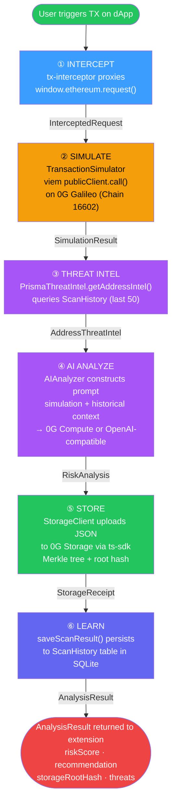

# Data Flow

Every transaction the SIFIX extension intercepts follows a **six-step pipeline** that runs from browser interception through on-chain storage. This page documents each step in detail, including input/output types, data transformations, and the exact flow of information between components.

---

## Pipeline Overview



---

## TypeScript Interfaces

### Core Types

```typescript
// Risk levels used throughout the pipeline
type RiskLevel = "LOW" | "MEDIUM" | "HIGH" | "CRITICAL";

// Recommendations returned by AI analysis
type Recommendation = "ALLOW" | "WARN" | "BLOCK";

// Transaction methods intercepted by the extension
type InterceptedMethod =
  | "eth_sendTransaction"
  | "eth_signTransaction"
  | "personal_sign"
  | "eth_sign"
  | "eth_signTypedData"
  | "eth_signTypedData_v1"
  | "eth_signTypedData_v3"
  | "eth_signTypedData_v4"
  | "wallet_addEthereumChain"
  | "wallet_switchEthereumChain";
```

---

## Step 1: INTERCEPT

The `tx-interceptor` content script runs in the **MAIN world** and replaces `window.ethereum.request()` with a JavaScript `Proxy` object. This happens **before any page scripts execute** — the script is injected at `webNavigation.onBeforeNavigate` with `injectImmediately: true`.

**How it works:**

1. The original `window.ethereum.request` is saved as `originalRequest`
2. A `Proxy` wraps the object, intercepting calls to `request()`
3. When a dApp calls an intercepted method, the proxy captures the parameters
4. Parameters are sent to the background worker via `chrome.runtime.sendMessage`
5. A pre-flight popup appears: **Simulate & Analyze** / **Proceed to Wallet** / **Cancel**
6. If the user chooses **Analyze**, the request continues to the API

**Input:** The raw `window.ethereum.request()` call from the dApp

```typescript
interface InterceptedRequest {
  /** The Ethereum JSON-RPC method name */
  method: InterceptedMethod;

  /** Array of request parameters (varies by method) */
  params: unknown[];

  /** URL of the page where the request originated */
  origin: string;

  /** Timestamp of interception */
  timestamp: number;

  /** ID for correlating the request with the response */
  requestId: string;
}
```

**Output:** Transaction parameters extracted for analysis

```typescript
interface TransactionParams {
  /** Sender address */
  from: `0x${string}`;

  /** Recipient address (contract or EOA) */
  to?: `0x${string}`;

  /** Encoded contract call data */
  data?: `0x${string}`;

  /** Value in wei being sent */
  value?: bigint;

  /** Gas limit */
  gas?: bigint;

  /** Max fee per gas (EIP-1559) */
  maxFeePerGas?: bigint;

  /** Max priority fee per gas */
  maxPriorityFeePerGas?: bigint;

  /** Nonce */
  nonce?: number;

  /** Chain ID */
  chainId?: number;
}
```

---

## Step 2: SIMULATE

Transaction parameters are sent to `POST /api/v1/extension/analyze` on the dApp server. The dApp creates a `TransactionSimulator` which uses **viem's `publicClient.call()`** against the 0G Galileo RPC (`https://evmrpc-testnet.0g.ai`). This simulates the transaction against the current chain state **without broadcasting**.

**What simulation reveals:**

- Whether the transaction would revert (and why)
- Gas usage estimates
- Balance changes for the sender and recipient
- Events that would be emitted
- State changes to contract storage

**Input:** Transaction parameters (from Step 1)

```typescript
interface SimulationInput {
  /** Transaction parameters */
  transaction: TransactionParams;

  /** Block tag to simulate against (default: "latest") */
  blockTag?: "latest" | "pending";

  /** 0G Galileo RPC URL */
  rpcUrl: string; // "https://evmrpc-testnet.0g.ai"
}
```

**Output:** Full simulation result

```typescript
interface SimulationResult {
  /** Whether the simulation succeeded or reverted */
  success: boolean;

  /** Gas used in the simulation */
  gasUsed: bigint;

  /** Estimated gas limit for the actual transaction */
  gasEstimate: bigint;

  /** Balance changes keyed by address */
  balanceChanges: Array<{
    address: `0x${string}`;
    change: bigint; // Negative = sent, Positive = received
    token?: {
      symbol: string;
      decimals: number;
    };
  }>;

  /** Events emitted during simulation */
  events: Array<{
    address: `0x${string}`;
    topics: `0x${string}`[];
    data: `0x${string}`;
    eventName?: string;
    args?: Record<string, unknown>;
  }>;

  /** Revert reason if the transaction would fail */
  revertReason?: string;

  /** Contract call trace */
  trace?: Array<{
    from: `0x${string}`;
    to: `0x${string}`;
    value: bigint;
    input: `0x${string}`;
    output?: `0x${string}`;
  }>;

  /** State diffs (if available) */
  stateChanges?: Record<
    `0x${string}`,
    Record<string, { old: string; new: string }>
  >;

  /** Simulation duration in milliseconds */
  duration: number;
}
```

---

## Step 3: THREAT INTEL

The `PrismaThreatIntel.getAddressIntel()` implementation queries the `ScanHistory` table in SQLite for the **last 50 scans** involving the target address. This provides historical context that helps the AI produce more accurate risk assessments.

**What threat intel provides:**

- How many times this address has been scanned
- Average and maximum risk scores from previous scans
- Known threats associated with the address
- Risk distribution (how many LOW/MEDIUM/HIGH/CRITICAL results)
- Recent scan summaries

**Input:** Address to look up

```typescript
interface ThreatIntelInput {
  /** The address to gather intelligence for */
  address: `0x${string}`;

  /** Maximum number of historical scans to consider */
  limit: number; // Default: 50

  /** Optional chain ID filter */
  chainId?: number;
}
```

**Output:** Aggregated threat intelligence

```typescript
interface AddressThreatIntel {
  /** The queried address */
  address: `0x${string}`;

  /** Total number of previous scans */
  totalScans: number;

  /** Average risk score across all scans (0–100) */
  avgRiskScore: number;

  /** Maximum risk score ever recorded */
  maxRiskScore: number;

  /** List of known threats associated with this address */
  knownThreats: Array<{
    type: string;
    severity: number;
    description: string;
    firstSeen: Date;
    lastSeen: Date;
  }>;

  /** Distribution of risk levels from historical scans */
  riskDistribution: {
    low: number;
    medium: number;
    high: number;
    critical: number;
  };

  /** Most recent scan summaries */
  recentScans: Array<{
    date: Date;
    riskScore: number;
    riskLevel: RiskLevel;
    recommendation: Recommendation;
    threats: string[];
    reasoning: string;
  }>;

  /** Community tags for this address */
  tags?: Array<{
    tag: string;
    upvotes: number;
    downvotes: number;
  }>;

  /** Whether this address appears on any watchlists */
  isWatchlisted: boolean;
}
```

---

## Step 4: AI ANALYZE

`AIAnalyzer.analyze()` constructs a structured prompt containing the simulation results and threat intelligence context. The prompt asks the AI to evaluate the transaction across multiple risk dimensions.

**AI provider routing:**

1. **0G Compute** — If `compute` config is provided (fully decentralized inference)
2. **Configured provider** — If `aiProvider` config is set (OpenAI, Groq, OpenRouter, Together AI, Ollama)
3. **Legacy** — If `openaiApiKey` is set (deprecated path)

**Input:** Simulation result + threat intelligence

```typescript
interface AIAnalysisInput {
  /** Simulation result from Step 2 */
  simulation: SimulationResult;

  /** Threat intelligence from Step 3 */
  threatIntel: AddressThreatIntel;

  /** Original transaction parameters */
  transaction: TransactionParams;

  /** The method that was intercepted */
  method: InterceptedMethod;

  /** Origin URL of the dApp */
  origin: string;
}
```

**Output:** Structured risk analysis

```typescript
interface RiskAnalysis {
  /** Overall risk score (0–100) */
  riskScore: number;

  /** Confidence level of the analysis (0–1) */
  confidence: number;

  /** Human-readable explanation of the risk assessment */
  reasoning: string;

  /** List of specific threats detected */
  threats: Array<{
    /** Threat category */
    type:
      | "REENTRANCY"
      | "APPROVAL_EXPLOIT"
      | "PHISHING"
      | "DUSTING"
      | "FRONT_RUNNING"
      | "RUG_PULL"
      | "SUSPICIOUS_CONTRACT"
      | "UNSUPPORTED_CHAIN"
      | "UNUSUAL_VALUE"
      | "KNOWN_SCAM"
      | "PERMISSION_OVERREACH"
      | "UNVERIFIED_SOURCE"
      | "CUSTOM";

    /** Severity of this specific threat */
    severity: RiskLevel;

    /** Description of the threat */
    description: string;

    /** Confidence in this specific detection */
    confidence: number;
  }>;

  /** Action recommendation */
  recommendation: Recommendation;

  /** Suggested safe alternatives or mitigations */
  mitigations?: string[];

  /** Which risk factors contributed most to the score */
  scoreBreakdown?: {
    simulationRisk: number; // 0–100 component
    historicalRisk: number; // 0–100 component
    behavioralRisk: number; // 0–100 component
    communityRisk: number; // 0–100 component
  };
}
```

---

## Step 5: STORE

`StorageClient.storeAnalysis()` serializes the complete analysis result into JSON and uploads it to **0G Storage** via `@0gfoundation/0g-storage-ts-sdk`. The upload creates a Merkle tree, and the root hash is stored on-chain as a permanent, tamper-proof reference.

**Storage properties:**

- Upload includes the full `AnalysisResult` JSON
- A Merkle tree is generated client-side
- The root hash anchors the data on-chain
- Content can be retrieved by hash from any 0G Storage node
- 3 retries with exponential backoff (2s, 4s delays)

**Input:** Complete analysis result

```typescript
interface StorageInput {
  /** The full analysis result to store */
  analysis: AnalysisResult;

  /** Whether to use mock mode (deterministic keccak256 hash) */
  mockMode: boolean;

  /** 0G Storage indexer URL */
  indexerUrl: string; // "https://indexer-storage-testnet-turbo.0g.ai"

  /** Private key for the upload transaction */
  privateKey: `0x${string}`;
}
```

**Output:** Storage receipt with reference data

```typescript
interface StorageReceipt {
  /** Merkle root hash of the uploaded data */
  rootHash: `0x${string}`;

  /** URL to view the data on the 0G Storage explorer */
  explorerUrl: string;

  /** Size of the uploaded data in bytes */
  dataSize: number;

  /** Timestamp of the upload */
  uploadedAt: Date;

  /** Whether the upload was real or mocked */
  isMock: boolean;
}
```

---

## Step 6: LEARN

`ThreatIntelProvider.saveScanResult()` persists the complete scan result to the `ScanHistory` table in SQLite. This creates a **self-improving feedback loop** — on the next scan involving the same address, Step 3 will return richer context.

**What gets persisted:**

- Target and sender addresses
- Risk score, level, and recommendation
- AI reasoning and detected threats
- 0G Storage root hash reference
- Confidence score
- Timestamp and duration

**Input:** Complete scan result for persistence

```typescript
interface ScanResultInput {
  /** Sender address */
  fromAddress: `0x${string}`;

  /** Target/recipient address */
  toAddress: `0x${string}`;

  /** Overall risk score */
  riskScore: number;

  /** Risk level classification */
  riskLevel: RiskLevel;

  /** AI recommendation */
  recommendation: Recommendation;

  /** AI reasoning text */
  reasoning: string;

  /** Detected threats as JSON array */
  threats: string[];

  /** Confidence score */
  confidence: number;

  /** 0G Storage root hash */
  rootHash: `0x${string}`;

  /** Scan duration in milliseconds */
  scanDuration: number;

  /** Agent version that performed the analysis */
  agentVersion: string;
}
```

**Output:** Persisted record confirmation

```typescript
interface ScanRecord {
  /** Auto-incremented record ID */
  id: string;

  /** Timestamp of persistence */
  createdAt: Date;

  /** The root hash reference for retrieval */
  rootHash: `0x${string}`;
}
```

---

## Composite: AnalysisResult

The final result returned to the extension combines outputs from all steps:

```typescript
interface AnalysisResult {
  /** Unique analysis ID */
  id: string;

  /** Timestamp of the analysis */
  timestamp: number;

  /** Original intercepted request */
  request: InterceptedRequest;

  /** Simulation results (Step 2) */
  simulation: SimulationResult;

  /** AI risk analysis (Step 4) */
  analysis: RiskAnalysis;

  /** 0G Storage receipt (Step 5) */
  storage: StorageReceipt;

  /** Total pipeline duration in milliseconds */
  totalDuration: number;

  /** Which AI provider was used */
  aiProvider: "0g-compute" | "openai" | "groq" | "ollama" | "custom";

  /** Agent version */
  agentVersion: string;
}
```

---

## Extension Presentation

Once the `AnalysisResult` is returned to the extension, the popup displays:

- **Risk Score** — Color-coded gauge (green → yellow → orange → red)
- **Risk Level** — SAFE / LOW / MEDIUM / HIGH / CRITICAL badge
- **Recommendation** — ALLOW / WARN / BLOCK with action button
- **AI Reasoning** — Human-readable explanation of the risk
- **Detected Threats** — List with type, severity, and description
- **0G Storage Proof** — Root hash with link to explorer
- **Balance Changes** — Token transfers from simulation
- **Action Buttons** — Proceed to Wallet / Block Transaction

---

## Error Handling

The pipeline handles failures at each step:

- **Step 1 failure:** If the proxy fails to intercept, the original request passes through unmodified (fail-open)
- **Step 2 failure:** If simulation fails (network error, RPC down), the analysis continues with `simulation.success = false` and the revert reason
- **Step 3 failure:** If threat intel is unavailable (new address, DB error), `totalScans = 0` and the AI relies solely on simulation data
- **Step 4 failure:** If AI analysis fails entirely (all providers down), the system returns a conservative WARN recommendation with the raw simulation data
- **Step 5 failure:** If 0G Storage upload fails after retries, the analysis still completes but `storage.isMock = true` with a local keccak256 hash
- **Step 6 failure:** If persistence fails, the analysis result is still returned to the user but the learning loop is broken for this scan

---

## See Also

- **[System Overview](/architecture/system-overview)** — Full architecture with all components
- **[Security Model](/architecture/security-model)** — How SIFIX protects each step
- **[Database Schema](/architecture/database-schema)** — Prisma models storing pipeline data
