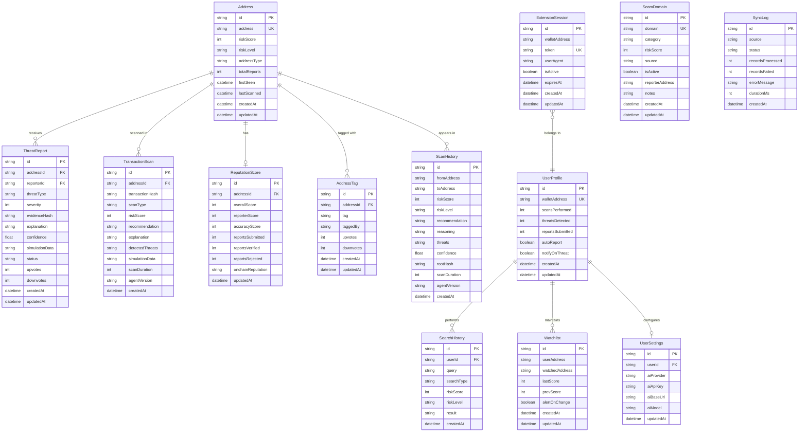

# Database Schema

SIFIX uses **Prisma 5** with **SQLite** for its database layer. The schema consists of **13 models** organized into three domains: Core (security data), Community (user-generated content), and System (configuration and sessions).

---

## Entity Relationship Diagram



---

## Core Models

### Address

Tracks blockchain addresses with aggregated risk data. This is the central entity that connects to threat reports, transaction scans, reputation scores, and community tags.

| Field | Type | Notes |
|-------|------|-------|
| `id` | `String @id @default(cuid())` | Primary key |
| `address` | `String @unique` | Checksummed Ethereum address |
| `riskScore` | `Int @default(0)` | Aggregated risk score 0–100 |
| `riskLevel` | `String @default("LOW")` | LOW, MEDIUM, HIGH, CRITICAL |
| `addressType` | `String @default("EOA")` | EOA, SMART_CONTRACT, PROXY |
| `totalReports` | `Int @default(0)` | Count of linked ThreatReports |
| `chain` | `String @default("0g-galileo")` | Network identifier |
| `firstSeen` | `DateTime @default(now())` | First time this address appeared |
| `lastScanned` | `DateTime?` | Most recent scan timestamp |
| `createdAt` | `DateTime @default(now())` | Record creation |
| `updatedAt` | `DateTime @updatedAt` | Last modification |

**Indexes:** `address` (unique), `riskScore`, `riskLevel`, `chain`

**Relations:**
- `ThreatReport[]` — Threat reports filed against this address
- `TransactionScan[]` — Scans involving this address
- `ReputationScore?` — Optional reputation data (1:1)
- `AddressTag[]` — Community-applied tags

```sql
-- SQL equivalent
CREATE TABLE Address (
    id TEXT PRIMARY KEY,
    address TEXT UNIQUE NOT NULL,
    riskScore INTEGER DEFAULT 0 CHECK (riskScore >= 0 AND riskScore <= 100),
    riskLevel TEXT DEFAULT 'LOW' CHECK (riskLevel IN ('LOW', 'MEDIUM', 'HIGH', 'CRITICAL')),
    addressType TEXT DEFAULT 'EOA' CHECK (addressType IN ('EOA', 'SMART_CONTRACT', 'PROXY')),
    totalReports INTEGER DEFAULT 0,
    chain TEXT DEFAULT '0g-galileo',
    firstSeen DATETIME DEFAULT CURRENT_TIMESTAMP,
    lastScanned DATETIME,
    createdAt DATETIME DEFAULT CURRENT_TIMESTAMP,
    updatedAt DATETIME DEFAULT CURRENT_TIMESTAMP
);
CREATE UNIQUE INDEX idx_address ON Address(address);
CREATE INDEX idx_address_risk_score ON Address(riskScore);
CREATE INDEX idx_address_risk_level ON Address(riskLevel);
CREATE INDEX idx_address_chain ON Address(chain);
```

---

### ThreatReport

Community-reported threats with AI-generated analysis and on-chain evidence. Supports a verification workflow: `PENDING` → `VERIFIED` / `REJECTED` / `DISPUTED`.

| Field | Type | Notes |
|-------|------|-------|
| `id` | `String @id @default(cuid())` | Primary key |
| `addressId` | `String` | FK → Address |
| `reporterId` | `String` | Wallet address of reporter |
| `threatType` | `String` | Category of threat |
| `severity` | `Int @default(50)` | 0–100 severity score |
| `evidenceHash` | `String?` | 0G Storage root hash |
| `explanation` | `String?` | AI-generated description |
| `confidence` | `Float @default(0)` | AI confidence 0–1 |
| `simulationData` | `String?` | JSON — simulation results |
| `status` | `String @default("PENDING")` | PENDING, VERIFIED, REJECTED, DISPUTED |
| `upvotes` | `Int @default(0)` | Community upvotes |
| `downvotes` | `Int @default(0)` | Community downvotes |
| `createdAt` | `DateTime @default(now())` | Report timestamp |
| `updatedAt` | `DateTime @updatedAt` | Last status change |

**Indexes:** `addressId`, `reporterId`, `threatType`, `status`, `createdAt`

**Relations:**
- `address` → `Address` (many-to-one)
- `votes` → `ReportVote[]` (one-to-many, implicit via API)

```sql
CREATE TABLE ThreatReport (
    id TEXT PRIMARY KEY,
    addressId TEXT NOT NULL REFERENCES Address(id),
    reporterId TEXT NOT NULL,
    threatType TEXT NOT NULL,
    severity INTEGER DEFAULT 50 CHECK (severity >= 0 AND severity <= 100),
    evidenceHash TEXT,
    explanation TEXT,
    confidence REAL DEFAULT 0 CHECK (confidence >= 0 AND confidence <= 1),
    simulationData TEXT, -- JSON
    status TEXT DEFAULT 'PENDING' CHECK (status IN ('PENDING', 'VERIFIED', 'REJECTED', 'DISPUTED')),
    upvotes INTEGER DEFAULT 0,
    downvotes INTEGER DEFAULT 0,
    createdAt DATETIME DEFAULT CURRENT_TIMESTAMP,
    updatedAt DATETIME DEFAULT CURRENT_TIMESTAMP
);
CREATE INDEX idx_threat_address ON ThreatReport(addressId);
CREATE INDEX idx_threat_reporter ON ThreatReport(reporterId);
CREATE INDEX idx_threat_type ON ThreatReport(threatType);
CREATE INDEX idx_threat_status ON ThreatReport(status);
CREATE INDEX idx_threat_created ON ThreatReport(createdAt);
```

---

### TransactionScan

Individual scan results with full simulation data and AI analysis output.

| Field | Type | Notes |
|-------|------|-------|
| `id` | `String @id @default(cuid())` | Primary key |
| `addressId` | `String` | FK → Address |
| `transactionHash` | `String?` | On-chain TX hash (if broadcast) |
| `scanType` | `String @default("MANUAL")` | MANUAL, EXTENSION, AUTOMATED |
| `riskScore` | `Int @default(0)` | AI-assigned risk score |
| `recommendation` | `String @default("APPROVE")` | APPROVE, REJECT, WARN |
| `explanation` | `String?` | AI reasoning text |
| `detectedThreats` | `String?` | JSON array of detected threats |
| `simulationData` | `String?` | JSON — gas used, state changes, events |
| `scanDuration` | `Int @default(0)` | Duration in milliseconds |
| `agentVersion` | `String @default("1.0.0")` | Agent SDK version |
| `createdAt` | `DateTime @default(now())` | Scan timestamp |

**Indexes:** `addressId`, `riskScore`, `recommendation`, `createdAt`

```sql
CREATE TABLE TransactionScan (
    id TEXT PRIMARY KEY,
    addressId TEXT NOT NULL REFERENCES Address(id),
    transactionHash TEXT,
    scanType TEXT DEFAULT 'MANUAL' CHECK (scanType IN ('MANUAL', 'EXTENSION', 'AUTOMATED')),
    riskScore INTEGER DEFAULT 0 CHECK (riskScore >= 0 AND riskScore <= 100),
    recommendation TEXT DEFAULT 'APPROVE' CHECK (recommendation IN ('APPROVE', 'REJECT', 'WARN')),
    explanation TEXT,
    detectedThreats TEXT, -- JSON
    simulationData TEXT, -- JSON
    scanDuration INTEGER DEFAULT 0,
    agentVersion TEXT DEFAULT '1.0.0',
    createdAt DATETIME DEFAULT CURRENT_TIMESTAMP
);
CREATE INDEX idx_scan_address ON TransactionScan(addressId);
CREATE INDEX idx_scan_risk ON TransactionScan(riskScore);
CREATE INDEX idx_scan_recommendation ON TransactionScan(recommendation);
CREATE INDEX idx_scan_created ON TransactionScan(createdAt);
```

---

### ReputationScore

Per-address reputation tracking for reporters and contributors. Scores are computed from report verification outcomes.

| Field | Type | Notes |
|-------|------|-------|
| `id` | `String @id @default(cuid())` | Primary key |
| `addressId` | `String @unique` | FK → Address (1:1) |
| `overallScore` | `Int @default(50)` | Composite score 0–100 |
| `reporterScore` | `Int @default(50)` | Reporting quality score |
| `accuracyScore` | `Int @default(50)` | Report accuracy score |
| `reportsSubmitted` | `Int @default(0)` | Total reports filed |
| `reportsVerified` | `Int @default(0)` | Reports confirmed valid |
| `reportsRejected` | `Int @default(0)` | Reports rejected |
| `onchainReputation` | `String?` | Smart contract reputation data |
| `updatedAt` | `DateTime @updatedAt` | Last recalculation |

```sql
CREATE TABLE ReputationScore (
    id TEXT PRIMARY KEY,
    addressId TEXT UNIQUE NOT NULL REFERENCES Address(id),
    overallScore INTEGER DEFAULT 50 CHECK (overallScore >= 0 AND overallScore <= 100),
    reporterScore INTEGER DEFAULT 50 CHECK (reporterScore >= 0 AND reporterScore <= 100),
    accuracyScore INTEGER DEFAULT 50 CHECK (accuracyScore >= 0 AND accuracyScore <= 100),
    reportsSubmitted INTEGER DEFAULT 0,
    reportsVerified INTEGER DEFAULT 0,
    reportsRejected INTEGER DEFAULT 0,
    onchainReputation TEXT,
    updatedAt DATETIME DEFAULT CURRENT_TIMESTAMP
);
```

---

## Community Models

### AddressTag

Community-applied labels on addresses. Users can tag addresses as "scam", "whale", "contract", etc. with upvote/downvote curation.

| Field | Type | Notes |
|-------|------|-------|
| `id` | `String @id @default(cuid())` | Primary key |
| `addressId` | `String` | FK → Address |
| `tag` | `String` | Label text |
| `taggedBy` | `String` | Wallet address of tagger |
| `upvotes` | `Int @default(0)` | Community agreement |
| `downvotes` | `Int @default(0)` | Community disagreement |
| `createdAt` | `DateTime @default(now())` | Tag timestamp |
| `updatedAt` | `DateTime @updatedAt` | Last vote change |

**Unique constraint:** `[@@unique([addressId, tag])]` — one tag per address

**Indexes:** `addressId`, `tag`, `taggedBy`

```sql
CREATE TABLE AddressTag (
    id TEXT PRIMARY KEY,
    addressId TEXT NOT NULL REFERENCES Address(id),
    tag TEXT NOT NULL,
    taggedBy TEXT NOT NULL,
    upvotes INTEGER DEFAULT 0,
    downvotes INTEGER DEFAULT 0,
    createdAt DATETIME DEFAULT CURRENT_TIMESTAMP,
    updatedAt DATETIME DEFAULT CURRENT_TIMESTAMP,
    UNIQUE(addressId, tag)
);
CREATE INDEX idx_tag_address ON AddressTag(addressId);
CREATE INDEX idx_tag_name ON AddressTag(tag);
CREATE INDEX idx_tag_tagger ON AddressTag(taggedBy);
```

---

### Watchlist

User-monitored addresses with risk delta tracking. Users subscribe to address risk changes.

| Field | Type | Notes |
|-------|------|-------|
| `id` | `String @id @default(cuid())` | Primary key |
| `userAddress` | `String` | Wallet address of the watcher |
| `watchedAddress` | `String` | Address being monitored |
| `lastScore` | `Int @default(0)` | Current risk score |
| `prevScore` | `Int @default(0)` | Previous risk score |
| `alertOnChange` | `Boolean @default(true)` | Notify on risk change |
| `createdAt` | `DateTime @default(now())` | Subscription start |
| `updatedAt` | `DateTime @updatedAt` | Last score update |

**Unique constraint:** `[@@unique([userAddress, watchedAddress])]`

```sql
CREATE TABLE Watchlist (
    id TEXT PRIMARY KEY,
    userAddress TEXT NOT NULL,
    watchedAddress TEXT NOT NULL,
    lastScore INTEGER DEFAULT 0,
    prevScore INTEGER DEFAULT 0,
    alertOnChange BOOLEAN DEFAULT 1,
    createdAt DATETIME DEFAULT CURRENT_TIMESTAMP,
    updatedAt DATETIME DEFAULT CURRENT_TIMESTAMP,
    UNIQUE(userAddress, watchedAddress)
);
```

---

### ScamDomain

Blacklisted domains with categorization and source tracking. Populated by community reports, automated scans, manual curation, and GoPlus data.

| Field | Type | Notes |
|-------|------|-------|
| `id` | `String @id @default(cuid())` | Primary key |
| `domain` | `String @unique` | Domain name |
| `category` | `String` | PHISHING, MALWARE, SCAM, RUGPULL, FAKE_AIRDROP |
| `riskScore` | `Int @default(80)` | Domain risk score |
| `source` | `String @default("COMMUNITY")` | COMMUNITY, AUTOMATED, MANUAL, GOPUS |
| `isActive` | `Boolean @default(true)` | Currently blacklisted |
| `reporterAddress` | `String?` | Wallet of reporter |
| `notes` | `String?` | Additional context |
| `createdAt` | `DateTime @default(now())` | First reported |
| `updatedAt` | `DateTime @updatedAt` | Last update |

**Indexes:** `domain` (unique), `category`, `isActive`, `source`

```sql
CREATE TABLE ScamDomain (
    id TEXT PRIMARY KEY,
    domain TEXT UNIQUE NOT NULL,
    category TEXT NOT NULL CHECK (category IN ('PHISHING', 'MALWARE', 'SCAM', 'RUGPULL', 'FAKE_AIRDROP')),
    riskScore INTEGER DEFAULT 80 CHECK (riskScore >= 0 AND riskScore <= 100),
    source TEXT DEFAULT 'COMMUNITY' CHECK (source IN ('COMMUNITY', 'AUTOMATED', 'MANUAL', 'GOPUS')),
    isActive BOOLEAN DEFAULT 1,
    reporterAddress TEXT,
    notes TEXT,
    createdAt DATETIME DEFAULT CURRENT_TIMESTAMP,
    updatedAt DATETIME DEFAULT CURRENT_TIMESTAMP
);
CREATE UNIQUE INDEX idx_scam_domain ON ScamDomain(domain);
CREATE INDEX idx_scam_category ON ScamDomain(category);
CREATE INDEX idx_scam_active ON ScamDomain(isActive);
CREATE INDEX idx_scam_source ON ScamDomain(source);
```

---

## System Models

### ScanHistory

Detailed scan records — this is the primary model queried by `ThreatIntelProvider.getAddressIntel()` for the threat intelligence step. Stores the complete analysis output for each scan.

| Field | Type | Notes |
|-------|------|-------|
| `id` | `String @id @default(cuid())` | Primary key |
| `fromAddress` | `String` | Transaction sender |
| `toAddress` | `String` | Transaction recipient |
| `riskScore` | `Int @default(0)` | AI risk score 0–100 |
| `riskLevel` | `String @default("LOW")` | LOW, MEDIUM, HIGH, CRITICAL |
| `recommendation` | `String @default("ALLOW")` | BLOCK, WARN, ALLOW |
| `reasoning` | `String?` | AI explanation |
| `threats` | `String?` | JSON array of detected threat types |
| `confidence` | `Float @default(0)` | AI confidence 0–1 |
| `rootHash` | `String?` | 0G Storage Merkle root |
| `scanDuration` | `Int @default(0)` | Duration in milliseconds |
| `agentVersion` | `String @default("1.0.0")` | Agent SDK version |
| `createdAt` | `DateTime @default(now())` | Scan timestamp |

**Indexes:** `fromAddress`, `toAddress`, `riskScore`, `riskLevel`, `createdAt`

**Key query:** `SELECT * FROM ScanHistory WHERE toAddress = ? ORDER BY createdAt DESC LIMIT 50`

```sql
CREATE TABLE ScanHistory (
    id TEXT PRIMARY KEY,
    fromAddress TEXT NOT NULL,
    toAddress TEXT NOT NULL,
    riskScore INTEGER DEFAULT 0 CHECK (riskScore >= 0 AND riskScore <= 100),
    riskLevel TEXT DEFAULT 'LOW' CHECK (riskLevel IN ('LOW', 'MEDIUM', 'HIGH', 'CRITICAL')),
    recommendation TEXT DEFAULT 'ALLOW' CHECK (recommendation IN ('BLOCK', 'WARN', 'ALLOW')),
    reasoning TEXT,
    threats TEXT, -- JSON
    confidence REAL DEFAULT 0 CHECK (confidence >= 0 AND confidence <= 1),
    rootHash TEXT,
    scanDuration INTEGER DEFAULT 0,
    agentVersion TEXT DEFAULT '1.0.0',
    createdAt DATETIME DEFAULT CURRENT_TIMESTAMP
);
CREATE INDEX idx_history_from ON ScanHistory(fromAddress);
CREATE INDEX idx_history_to ON ScanHistory(toAddress);
CREATE INDEX idx_history_risk_score ON ScanHistory(riskScore);
CREATE INDEX idx_history_risk_level ON ScanHistory(riskLevel);
CREATE INDEX idx_history_created ON ScanHistory(createdAt);
```

---

### UserProfile

User statistics and notification preferences. One profile per wallet address.

| Field | Type | Notes |
|-------|------|-------|
| `id` | `String @id @default(cuid())` | Primary key |
| `walletAddress` | `String @unique` | User's wallet |
| `scansPerformed` | `Int @default(0)` | Lifetime scan count |
| `threatsDetected` | `Int @default(0)` | Threats found in scans |
| `reportsSubmitted` | `Int @default(0)` | Reports filed |
| `autoReport` | `Boolean @default(false)` | Auto-report high-risk findings |
| `notifyOnThreat` | `Boolean @default(true)` | Push notifications |
| `createdAt` | `DateTime @default(now())` | Registration |
| `updatedAt` | `DateTime @updatedAt` | Last update |

```sql
CREATE TABLE UserProfile (
    id TEXT PRIMARY KEY,
    walletAddress TEXT UNIQUE NOT NULL,
    scansPerformed INTEGER DEFAULT 0,
    threatsDetected INTEGER DEFAULT 0,
    reportsSubmitted INTEGER DEFAULT 0,
    autoReport BOOLEAN DEFAULT 0,
    notifyOnThreat BOOLEAN DEFAULT 1,
    createdAt DATETIME DEFAULT CURRENT_TIMESTAMP,
    updatedAt DATETIME DEFAULT CURRENT_TIMESTAMP
);
CREATE UNIQUE INDEX idx_user_wallet ON UserProfile(walletAddress);
```

---

### SearchHistory

Historical search queries with risk score snapshots. Used for the dashboard history view.

| Field | Type | Notes |
|-------|------|-------|
| `id` | `String @id @default(cuid())` | Primary key |
| `userId` | `String` | FK → UserProfile |
| `query` | `String` | Search input (address, domain, TX hash) |
| `searchType` | `String` | address, transaction, domain |
| `riskScore` | `Int @default(0)` | Result risk score |
| `riskLevel` | `String @default("LOW")` | Result risk level |
| `result` | `String?` | JSON snapshot of search result |
| `createdAt` | `DateTime @default(now())` | Search timestamp |

**Indexes:** `userId`, `searchType`, `createdAt`

```sql
CREATE TABLE SearchHistory (
    id TEXT PRIMARY KEY,
    userId TEXT NOT NULL REFERENCES UserProfile(id),
    query TEXT NOT NULL,
    searchType TEXT NOT NULL CHECK (searchType IN ('address', 'transaction', 'domain')),
    riskScore INTEGER DEFAULT 0,
    riskLevel TEXT DEFAULT 'LOW',
    result TEXT, -- JSON
    createdAt DATETIME DEFAULT CURRENT_TIMESTAMP
);
CREATE INDEX idx_search_user ON SearchHistory(userId);
CREATE INDEX idx_search_type ON SearchHistory(searchType);
CREATE INDEX idx_search_created ON SearchHistory(createdAt);
```

---

### SyncLog

Synchronization audit log for tracking data consistency between SQLite, 0G Storage, and smart contracts.

| Field | Type | Notes |
|-------|------|-------|
| `id` | `String @id @default(cuid())` | Primary key |
| `source` | `String` | 0g-storage, contract |
| `status` | `String` | success, failed |
| `recordsProcessed` | `Int @default(0)` | Records synced |
| `recordsFailed` | `Int @default(0)` | Failed records |
| `errorMessage` | `String?` | Error details |
| `durationMs` | `Int @default(0)` | Sync duration |
| `createdAt` | `DateTime @default(now())` | Sync timestamp |

```sql
CREATE TABLE SyncLog (
    id TEXT PRIMARY KEY,
    source TEXT NOT NULL CHECK (source IN ('0g-storage', 'contract')),
    status TEXT NOT NULL CHECK (status IN ('success', 'failed')),
    recordsProcessed INTEGER DEFAULT 0,
    recordsFailed INTEGER DEFAULT 0,
    errorMessage TEXT,
    durationMs INTEGER DEFAULT 0,
    createdAt DATETIME DEFAULT CURRENT_TIMESTAMP
);
```

---

### UserSettings

Per-address AI provider configuration. Controls which AI backend the agent uses for this user's analyses.

| Field | Type | Notes |
|-------|------|-------|
| `id` | `String @id @default(cuid())` | Primary key |
| `userId` | `String @unique` | FK → UserProfile |
| `aiProvider` | `String @default("default")` | default, openai, groq, 0g-compute, ollama, custom |
| `aiApiKey` | `String?` | User's own API key (encrypted at rest) |
| `aiBaseUrl` | `String?` | Custom API endpoint |
| `aiModel` | `String?` | Model name override |
| `updatedAt` | `DateTime @updatedAt` | Last configuration change |

```sql
CREATE TABLE UserSettings (
    id TEXT PRIMARY KEY,
    userId TEXT UNIQUE NOT NULL REFERENCES UserProfile(id),
    aiProvider TEXT DEFAULT 'default' CHECK (aiProvider IN ('default', 'openai', 'groq', '0g-compute', 'ollama', 'custom')),
    aiApiKey TEXT,
    aiBaseUrl TEXT,
    aiModel TEXT,
    updatedAt DATETIME DEFAULT CURRENT_TIMESTAMP
);
```

---

### ExtensionSession

JWT sessions for the browser extension. Tracks active extension connections with per-session tokens.

| Field | Type | Notes |
|-------|------|-------|
| `id` | `String @id @default(cuid())` | Primary key |
| `walletAddress` | `String` | Connected wallet |
| `token` | `String @unique` | JWT token value |
| `userAgent` | `String?` | Browser user agent |
| `isActive` | `Boolean @default(true)` | Session status |
| `expiresAt` | `DateTime` | Token expiry |
| `createdAt` | `DateTime @default(now())` | Session start |
| `updatedAt` | `DateTime @updatedAt` | Last activity |

**Indexes:** `token` (unique), `walletAddress`, `expiresAt`, `isActive`

```sql
CREATE TABLE ExtensionSession (
    id TEXT PRIMARY KEY,
    walletAddress TEXT NOT NULL,
    token TEXT UNIQUE NOT NULL,
    userAgent TEXT,
    isActive BOOLEAN DEFAULT 1,
    expiresAt DATETIME NOT NULL,
    createdAt DATETIME DEFAULT CURRENT_TIMESTAMP,
    updatedAt DATETIME DEFAULT CURRENT_TIMESTAMP
);
CREATE UNIQUE INDEX idx_session_token ON ExtensionSession(token);
CREATE INDEX idx_session_wallet ON ExtensionSession(walletAddress);
CREATE INDEX idx_session_expires ON ExtensionSession(expiresAt);
CREATE INDEX idx_session_active ON ExtensionSession(isActive);
```

---

## Model Summary

| Domain | Model | Purpose | Key Relations |
|--------|-------|---------|---------------|
| Core | `Address` | Tracked addresses | → ThreatReport, TransactionScan, ReputationScore, AddressTag |
| Core | `ThreatReport` | Community threats | → Address |
| Core | `TransactionScan` | Scan results | → Address |
| Core | `ReputationScore` | Address reputation | → Address (1:1) |
| Community | `AddressTag` | Address labels | → Address |
| Community | `Watchlist` | Monitored addresses | → UserProfile |
| Community | `ScamDomain` | Blacklisted domains | Standalone |
| System | `ScanHistory` | Detailed scan log | Standalone (queried by ThreatIntelProvider) |
| System | `UserProfile` | User stats | → SearchHistory, Watchlist, UserSettings |
| System | `SearchHistory` | Search audit | → UserProfile |
| System | `SyncLog` | Sync audit | Standalone |
| System | `UserSettings` | AI config | → UserProfile (1:1) |
| System | `ExtensionSession` | JWT sessions | → UserProfile |

---

## See Also

- **[System Overview](/architecture/system-overview)** — How the database fits into the full architecture
- **[Data Flow](/architecture/data-flow)** — How ScanHistory feeds the threat intel pipeline
- **[Auth Flow](/architecture/auth-flow)** — ExtensionSession and SIWE token lifecycle
