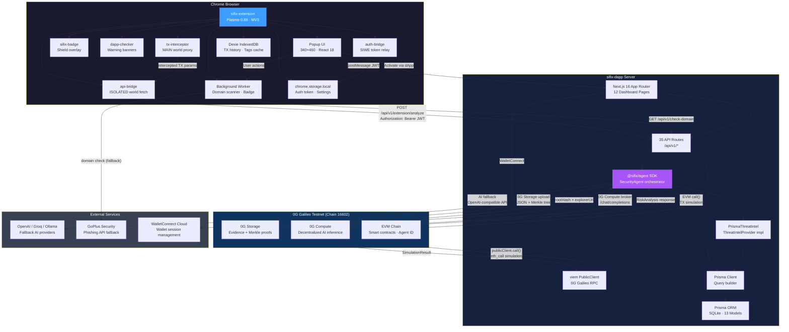

# System Overview

> **🎯 TL;DR**
> SIFIX is like a **smart security guard for your crypto wallet**. When you're about to send a transaction on a blockchain app, SIFIX quietly steps in, tests what would happen if you sent it (without actually sending anything), asks an AI to check for danger signs, and then tells you whether it's safe to proceed. It runs as a Chrome browser extension, talks to a backend server for the heavy lifting, and stores its findings on a decentralized network so nobody can tamper with the results.

## What Is SIFIX? (Plain-English Overview)

If you've ever used a crypto wallet like MetaMask to interact with a blockchain app (a "dApp"), you know the feeling: you click a button, a popup asks you to confirm a transaction, and you have to trust that everything is fine. But what if the app is malicious? What if confirming that transaction drains your wallet?

**SIFIX exists to answer that question before you confirm.**

Here's how it works in everyday terms:

1. **It watches your browser.** The SIFIX Chrome extension sits between you and the blockchain. When a website asks your wallet to do something, SIFIX catches that request first — like a bouncer checking IDs at the door.
2. **It does a dry run.** Instead of sending the real transaction, SIFIX simulates it on the blockchain to see what would actually happen. Would money leave your account? Would a smart contract do something unexpected?
3. **It asks an AI for a second opinion.** The simulation results are sent to an AI that's trained to spot red flags — things like phishing attempts, scam contracts, or suspicious token approvals.
4. **It shows you the verdict.** You get a clear risk score (safe → critical) with a plain-English explanation, so you can make an informed decision.
5. **It remembers.** Every scan is saved, so the system gets smarter over time. If an address has been flagged as dangerous before, you'll know immediately.

SIFIX is built entirely on the **0G Galileo Testnet** (a blockchain test network) and consists of three pieces of software that work together: a browser extension, a web server, and a security analysis toolkit.

---

## Technical Architecture

SIFIX is a three-part system on **0G Galileo (Chain 16602)**:

- **Extension**: catches risky actions before wallet signature.
- **dApp server**: runs API + orchestration.
- **Agent SDK**: simulates, analyzes, scores, and stores evidence.

In short: **capture → simulate → analyze → explain**.

The goal is simple: make transaction risk understandable before user signs.

---

## Architecture Diagram

---

## Three-Component Architecture

### sifix-extension

A **Plasmo 0.88** Chrome Manifest V3 extension that serves as the user-facing entry point.

- **Role:** Intercepts wallet transactions at the browser level, scans domains for safety, and displays real-time security indicators
- **Tech:** React 18, Plasmo framework, Dexie IndexedDB, chrome.storage API
- **Content Scripts:** 5 scripts across MAIN and ISOLATED worlds — `tx-interceptor`, `api-bridge`, `sifix-badge`, `dapp-checker`, `auth-bridge`
- **Background Worker:** Manages domain safety scans (5-layer pipeline), per-tab badge updates, and message routing between popup and content scripts
- **Early Injection:** `tx-interceptor.js` is injected at `webNavigation.onBeforeNavigate` with `injectImmediately: true` in the MAIN world — ensuring the `window.ethereum` proxy is in place before any page scripts execute

### sifix-dapp

A **Next.js 16** application serving as both the web dashboard and the REST API backend.

- **Role:** Hosts 12 dashboard pages for threat monitoring, scanning, analytics, and settings; provides 35 authenticated API routes consumed by the extension and dashboard
- **Tech:** React 19, Wagmi v3, TanStack React Query, Prisma 5 (SQLite), Zod validation, TailwindCSS 4
- **Database:** Prisma ORM with SQLite, 13 models covering core security data, community features, and system state
- **Threat Intel:** Implements `ThreatIntelProvider` interface from the agent SDK, bridging the database to the analysis pipeline
- **Auth:** SIWE (Sign-In with Ethereum) authentication issuing JWT tokens for extension and dashboard sessions

### sifix-agent

The core security analysis SDK published as `@sifix/agent` on npm.

- **Role:** Orchestrates the full analysis pipeline — simulation, threat intelligence gathering, AI risk analysis, and decentralized storage
- **Key Classes:** `SecurityAgent` (orchestrator), `TransactionSimulator` (viem-based), `AIAnalyzer` (dual-provider), `StorageClient` (0G Storage), `ComputeClient` (0G Compute), `ThreatIntelProvider` (interface)
- **Database-Agnostic:** Consumers inject a `ThreatIntelProvider` implementation to supply historical scan context
- **AI Routing Priority:** 0G Compute (decentralized) → configured OpenAI-compatible provider → legacy `openaiApiKey`

---

## Communication Protocols

### Browser ↔ DApp Server

- **Protocol:** HTTPS (REST)
- **Auth:** Bearer JWT token obtained via SIWE flow
- **Endpoints used by extension:**
  - `POST /api/v1/extension/analyze` — Transaction analysis
  - `POST /api/v1/extension/scan` — Address scanning
  - `GET /api/v1/check-domain` — Domain safety checks
  - `GET /api/v1/extension/settings` — Extension configuration
  - `POST /api/v1/auth/nonce` — SIWE nonce request
  - `POST /api/v1/auth/verify` — SIWE signature verification
  - `POST /api/v1/auth/verify-token` — Token validation
- **Content-Type:** `application/json`
- **Token storage:** `chrome.storage.local` (injected via `postMessage` from dApp page)

### DApp Server ↔ 0G Galileo

- **EVM RPC:** `https://evmrpc-testnet.0g.ai` — Transaction simulation via `eth_call`
- **0G Storage Indexer:** `https://indexer-storage-testnet-turbo.0g.ai` — JSON upload/download with Merkle proofs
- **0G Compute:** Broker-based decentralized AI inference via `/chat/completions` endpoint
- **Chain ID:** 16602
- **Block Explorer:** `https://chainscan-galileo.0g.ai`

### DApp Server ↔ External APIs

- **AI Fallback:** Any OpenAI-compatible API (OpenAI, Groq, OpenRouter, Together AI, Ollama) — used when 0G Compute is not configured
- **GoPlus Security:** Phishing domain detection API — used as a fallback when the SIFIX domain check API fails
- **WalletConnect Cloud:** Wallet session management via `NEXT_PUBLIC_WALLETCONNECT_PROJECT_ID`

---

## Port & Network Configuration

| Component | Default Port | Protocol | Notes |
|-----------|-------------|----------|-------|
| sifix-dapp (dev) | 3000 | HTTP | `pnpm dev` → `http://localhost:3000` |
| 0G Galileo RPC | 443 | HTTPS | `https://evmrpc-testnet.0g.ai` |
| 0G Storage Indexer | 443 | HTTPS | `https://indexer-storage-testnet-turbo.0g.ai` |
| 0G Compute | 443 | HTTPS | Broker endpoint (varies by provider) |
| AI Fallback API | 443 | HTTPS | Provider-specific (e.g., `api.openai.com`) |
| GoPlus API | 443 | HTTPS | `https://api.gopluslabs.io` |

> The extension has no standalone server — it communicates exclusively through the dApp API routes and external endpoints via the background service worker's `fetch()` calls.

---

## Data Flow Summary

Every transaction intercepted by the extension follows a **six-step pipeline**:

1. **INTERCEPT** — `tx-interceptor` proxies `window.ethereum.request()` in the MAIN world
2. **SIMULATE** — `TransactionSimulator` uses viem `publicClient.call()` against 0G Galileo
3. **THREAT INTEL** — `PrismaThreatIntel.getAddressIntel()` queries the last 50 scans from SQLite
4. **AI ANALYZE** — `AIAnalyzer` sends a structured prompt with simulation + historical context → returns `riskScore`, `confidence`, `reasoning`, `threats[]`, and `recommendation`
5. **STORE** — `StorageClient` uploads analysis JSON to 0G Storage, returns `rootHash` + `explorerUrl`
6. **LEARN** — `saveScanResult()` persists to the database, enriching future scans

See [Data Flow](/architecture/data-flow) for the detailed breakdown with TypeScript interfaces.

---

## Risk Scoring System

The agent returns a risk score from 0 to 100, mapped to four risk levels:

- **0–39 (SAFE/LOW)** → **ALLOW** — Transaction appears safe, proceed normally
- **40–59 (MEDIUM)** → **WARN** — Some concerns detected, user should review carefully
- **60–79 (HIGH)** → **BLOCK** — Significant risk, transaction blocked by default
- **80–100 (CRITICAL)** → **BLOCK** — Severe threat detected, almost certainly malicious

---

## 0G Galileo Services

SIFIX uses three distinct 0G services:

- **0G Storage** — Permanent, decentralized evidence storage. Analysis results are serialized as JSON, uploaded via the `@0gfoundation/0g-storage-ts-sdk`, Merkle-tree verified, and referenced by root hash. The `StorageClient` handles uploads with 3 retries and exponential backoff (2s, 4s delays). Supports mock mode for local development (deterministic `keccak256` hashes).
- **0G Compute** — Decentralized AI inference. The `ComputeClient` initializes a broker, acknowledges the provider signer, fetches service metadata (endpoint + model), and routes `/chat/completions` requests through the network. This is the primary AI provider when configured.
- **0G EVM** — The EVM-compatible chain (ID: 16602) used for transaction simulation (`eth_call`), smart contract interactions, and ERC-7857 Agentic Identity for agent provenance tracking.

---

## What's Next

- **[Data Flow](/architecture/data-flow)** — Detailed 6-step pipeline with TypeScript interfaces
- **[Security Model](/architecture/security-model)** — Extension, agent, and smart contract security
- **[Database Schema](/architecture/database-schema)** — All 13 Prisma models with relations
- **[Auth Flow](/architecture/auth-flow)** — SIWE authentication deep dive
