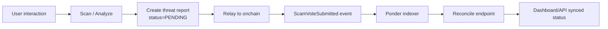
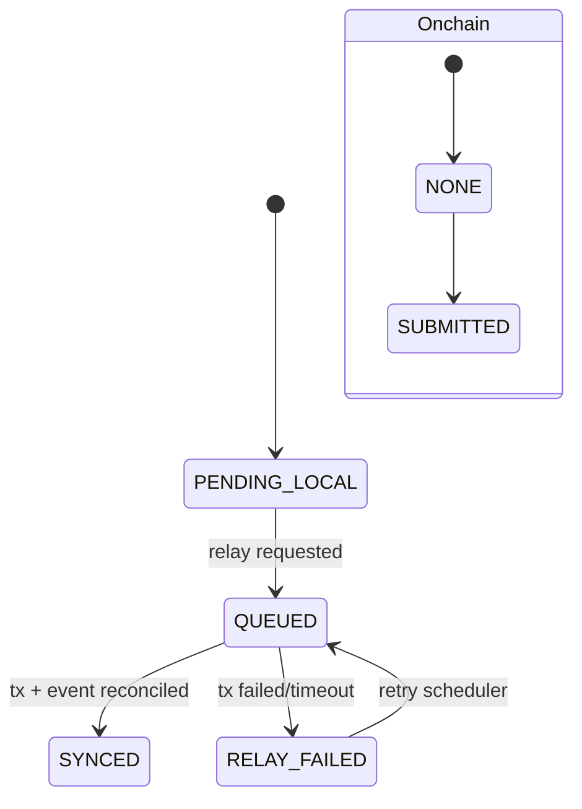

# 🛡️ SIFIX

**AI-Powered Wallet Security for Web3**

*Every 14 seconds, a Web3 user falls victim to a scam. SIFIX stops it before it happens.*

  
  
  
  

---

## Why SIFIX exists

Web3 security still has one core problem: users sign transactions they do not fully understand. Attackers exploit that gap with phishing domains, malicious approvals, and deceptive contract calls.

SIFIX exists to move security **before signature**, not after loss.

## What SIFIX is

SIFIX is a security system made of four connected repos:

- `sifix-extension` — browser interception and warning layer
- `sifix-dapp` — dashboard, API, moderation, sync status
- `sifix-agent` — AI simulation and risk analysis SDK
- `sifix-indexer` — Ponder indexer for onchain event truth

Baseline network: **0G Galileo Testnet (Chain ID 16602)**.

## How SIFIX works

### Sync lifecycle

## Why this matters (impact)

- Reduces blind-sign incidents with pre-sign warnings
- Gives transparent moderation flow (`PENDING`, vote, override)
- Keeps sync observability clear (`QUEUED`, `SYNCED`, `RELAY_FAILED`)
- Anchors evidence with onchain events, not UI assumptions only

## Current progress (May 2026)

- Chain-aware scan validation hardened
- Live guard probes added to dashboard status
- Relay endpoints added:
  - `POST /api/v1/threats/[id]/relay`
  - `POST /api/v1/threats/[id]/vote/relay`
- Reconcile endpoint added:
  - `POST /api/internal/reconcile/onchain`
- `sifix-indexer` scaffolded with Ponder + reconcile push script

## Start from here

- Product intro: [Introduction](./overview/introduction)
- API integration: [REST API](./api-reference/rest-api)
- SDK usage: [@sifix/agent SDK](./api-reference/agent-sdk)
- Setup: [Installation Guide](./guides/installation)
- Deep internals: [System Overview](./architecture/system-overview)
