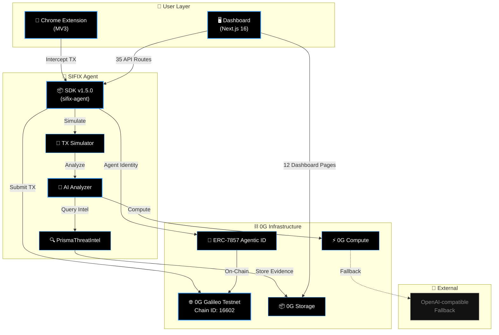
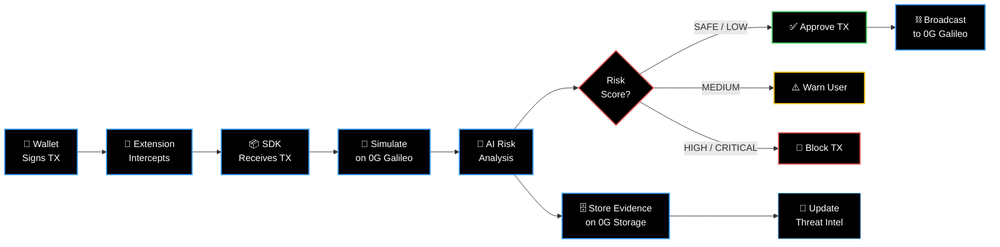

# 🔐 SIFIX

> **AI-Powered Wallet Security for Web3**

[](https://0g.ai)
[](https://explorer.0g.ai)
[](https://opensource.org/licenses/MIT)
[](https://github.com/sifix-xyz/sifix-agent)
[](https://0g.ai)

---

## What is SIFIX?

SIFIX is an **autonomous AI security agent** that protects Web3 wallets in real time. Every outgoing transaction is intercepted, simulated, and analyzed by AI before it reaches the network. Suspicious activity is flagged with a **5-tier risk score**, and all evidence is stored immutably on-chain via **0G Storage**.

Built for the **0G Chain APAC Hackathon 2026**, SIFIX combines AI-driven threat detection with decentralized infrastructure to deliver trustless, transparent wallet protection.

### Core Capabilities

- **🛡️ Transaction Interception** — Chrome extension (MV3) hooks into wallet RPC calls in real time
- **🧪 On-Demand Simulation** — Every TX is simulated against the 0G Galileo testnet before signing
- **🤖 AI-Powered Analysis** — 0G Compute (primary) or OpenAI-compatible models classify risk
- **🗄️ Immutable Evidence** — Security reports anchored to 0G Storage, tamper-proof and auditable
- **🧠 Adaptive Learning** — PrismaThreatIntel engine learns from historical scans to improve detection
- **🪪 Agentic Identity** — ERC-7857 agent identity minted on 0G Galileo for verifiable on-chain reputation

---

## System Architecture



---

## Transaction Pipeline



---

## Risk Scoring

Every analyzed transaction receives a **5-tier risk classification**:

| Tier | Label | Color | Action |
|------|-------|-------|--------|
| 0 | ✅ **SAFE** | Green | Auto-approve — no threat indicators detected |
| 1 | 🟢 **LOW** | Lime | Approve with minor flag — informational only |
| 2 | 🟡 **MEDIUM** | Yellow | Warn user — suspicious patterns present |
| 3 | 🟠 **HIGH** | Orange | Block TX — likely malicious, require override |
| 4 | 🔴 **CRITICAL** | Red | Hard block — confirmed exploit or attack |

---

## Agentic Identity

SIFIX operates as a verifiable on-chain agent via **ERC-7857 Agentic ID**:

- **Standard:** ERC-7857
- **Network:** 0G Galileo Testnet (Chain ID `16602`)
- **Contract:** `0x2700F6A3e505402C9daB154C5c6ab9cAEC98EF1F`
- **Token ID:** `99`

This identity anchors every SIFIX action to a persistent, auditable on-chain persona — enabling trust verification for automated security decisions.

---

## Repositories

| Repo | Description | Stack |
|------|-------------|-------|
| **[sifix-agent](https://github.com/sifix-xyz/sifix-agent)** | Core SDK — TX simulation, AI analysis, threat intel | TypeScript · SDK v1.5.0 |
| **[sifix-dapp](https://github.com/sifix-xyz/sifix-dapp)** | Web dashboard — 35 API routes, 12 pages, real-time monitoring | Next.js 16 · React |
| **[sifix-extension](https://github.com/sifix-xyz/sifix-extension)** | Browser extension — intercepts wallet RPC calls before signing | Chrome MV3 |

---

## Quick Start

### 1. Install the SDK

```bash
npm install @sifix/agent
```

### 2. Initialize the Agent

```typescript
import { SifixAgent } from "@sifix/agent";

const agent = new SifixAgent({
  network: {
    chainId: 16602,
    rpcUrl: "https://evmrpc-testnet.0g.ai",
    name: "0G Galileo Testnet",
  },
  ai: {
    provider: "0g-compute",   // primary
    fallback: "openai",        // fallback
  },
  storage: {
    provider: "0g-storage",
  },
  identity: {
    contract: "0x2700F6A3e505402C9daB154C5c6ab9cAEC98EF1F",
    tokenId: 99,
  },
});

await agent.start();
```

### 3. Analyze a Transaction

```typescript
const report = await agent.analyze({
  from: "0xYourWalletAddress...",
  to: "0xDestinationAddress...",
  value: "1.5",
  data: "0x...",
});

console.log(report.risk);    // "SAFE" | "LOW" | "MEDIUM" | "HIGH" | "CRITICAL"
console.log(report.score);   // 0–4
console.log(report.reason);  // Human-readable explanation
console.log(report.evidenceCID); // 0G Storage content ID
```

### 4. Install the Chrome Extension

1. Clone [`sifix-extension`](https://github.com/sifix-xyz/sifix-extension)
2. Run `npm run build`
3. Load `dist/` as an **unpacked extension** in `chrome://extensions`
4. Connect your wallet — SIFIX will automatically intercept and protect every transaction

### 5. Launch the Dashboard

```bash
git clone https://github.com/sifix-xyz/sifix-dapp.git
cd sifix-dapp
cp .env.example .env.local
# Configure your 0G Galileo RPC and API keys
npm install
npm run dev
```

Open **`http://localhost:3000`** to access 12 dashboard pages with real-time threat monitoring, historical scan analytics, and on-chain evidence explorer.

---

## Tech Stack

- **Network:** 0G Galileo Testnet (Chain ID `16602`)
- **AI Compute:** 0G Compute (primary) · OpenAI-compatible API (fallback)
- **Storage:** 0G Storage (immutable evidence)
- **Identity:** ERC-7857 on 0G Galileo
- **Agent SDK:** TypeScript, v1.5.0
- **Dashboard:** Next.js 16, 35 API routes, 12 pages
- **Extension:** Chrome Manifest V3
- **Design:** Glassmorphism · Pure Black `#000` · Accent Blue `#3b9eff`

---

## Hackathon

**SIFIX** is built for the **0G Chain APAC Hackathon 2026**.

The project demonstrates how 0G's AI compute, decentralized storage, and EVM-compatible chain can be composed into a real-time, autonomous security layer for Web3 wallets — with every decision backed by verifiable on-chain evidence and a persistent agentic identity.

---

## License

MIT © SIFIX Team
