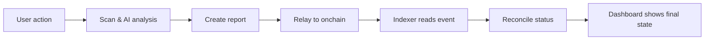
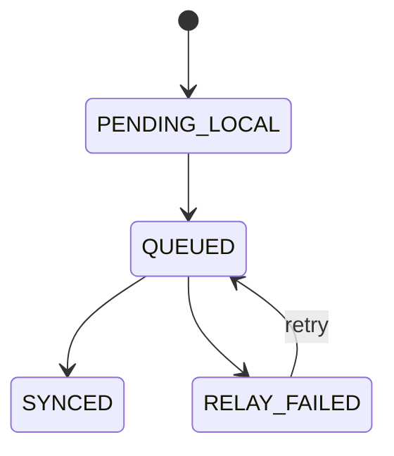

# 🛡️ SIFIX

**AI-Powered Wallet Security for Web3**

*Every 14 seconds, a Web3 user falls victim to a scam. SIFIX stops it before it happens.*

  
  
  
  

---

## Problem we solve

Most Web3 losses happen before users realize risk.

People click **Approve** on transactions they do not fully understand. Scam sites and malicious contracts are built to look normal. Wallets usually ask for signature, but do not explain danger in plain language.

Result: one wrong click can drain funds.

## SIFIX solution

SIFIX acts like a security checkpoint before signature.

- It checks address/domain/transaction risk
- It explains risk in simple language
- It gives clear recommendation (safe, caution, block)
- It keeps report + verification trail transparent

So user decides with context, not guesswork.

## How it works (simple flow)

## Status flow (behind the scenes)

## Why this matters

### For users
- Better protection before signing
- Less confusion on risky transactions
- More confidence when using Web3 apps

### For community and ecosystem
- Reports are verifiable, not random claims
- Moderation and sync state are visible
- Onchain events provide stronger accountability

## Current progress

- Chain-aware scan validation hardened
- Live guard health status in dashboard
- Relay endpoints active
- Reconcile endpoint active
- Ponder indexer integrated for sync pipeline

## Start here

- New to SIFIX: [Introduction](./overview/introduction)
- Integrating API: [REST API](./api-reference/rest-api)
- Using SDK: [@sifix/agent SDK](./api-reference/agent-sdk)
- Setup guide: [Installation](./guides/installation)
- Architecture details: [System Overview](./architecture/system-overview)
