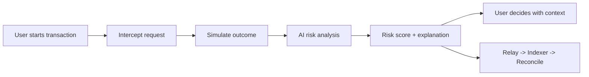

# 🛡️ SIFIX

**AI-Powered Wallet Security for Web3**

*Every 14 seconds, a Web3 user falls victim to a scam. SIFIX helps stop it before signature.*

  
  
  
  

---

## What is SIFIX?

SIFIX is a security layer for crypto wallets.

Before you sign a transaction, SIFIX runs a safety check and explains risk in plain language. Not just "approve or reject" — but **what this transaction will do**, **why it can be dangerous**, and **what you should do next**.

Think of SIFIX like a spell-checker for Web3 transactions.

---

## Why this matters

Most wallet losses happen in one moment: user clicks **Approve** without full context.

Attackers exploit this with:
- fake dApp pages,
- hidden unlimited approvals,
- malicious contracts that look normal,
- social-engineering signatures.

When wallet UI only shows technical prompts, users sign blind.

---

## The solution SIFIX offers

SIFIX changes transaction security from **reactive** to **preventive**.

Instead of warning users after funds are gone, SIFIX checks risk **before signature** and gives a clear decision aid:
- safe to continue,
- caution and review,
- high risk, stop now.

It also keeps verifiable evidence through a user-published onchain flow (wallet tx -> indexer -> reconcile), so security signals stay transparent and auditable.

---

## How SIFIX works

Simple flow:
1. Catch transaction request from wallet flow.
2. Simulate what would happen (read-only).
3. Analyze pattern with AI.
4. Return risk score + plain-language reason.
5. Sync outcome to dashboard pipeline.

---

## Impact

### For users
- Better protection before signing
- Less confusion on complex transactions
- More confidence using Web3 apps

### For ecosystem
- Transparent threat reporting
- Stronger moderation + verification trail
- Better shared threat intelligence over time

---

## Start here

- New to SIFIX: [Introduction](./overview/introduction)
- Understand the risk landscape: [Problem Statement](./overview/problem-statement)
- See the protection model: [Solution](./overview/solution)
- Integrate with backend: [REST API](./api-reference/rest-api)
- Integrate with SDK: [@sifix/agent SDK](./api-reference/agent-sdk)
- Dive into architecture: [System Overview](./architecture/system-overview)
