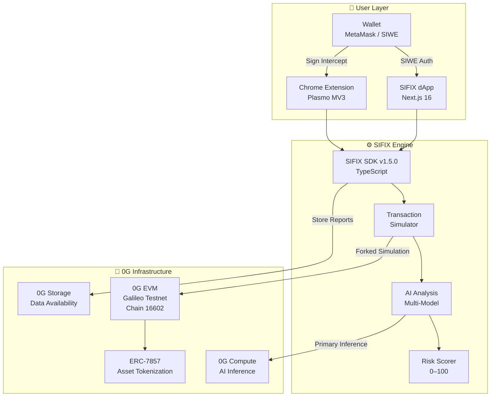

# Introduction to SIFIX

## What is SIFIX?

SIFIX is an **AI-Powered Wallet Security platform for Web3** that acts as an intelligent guardian between users and malicious on-chain activity. It intercepts, simulates, and analyzes every transaction before it reaches the blockchain — providing real-time risk assessment and protection against phishing, rug pulls, approval scams, and other exploits.

Built on the **0G Galileo Testnet** (Chain ID: `16602`), SIFIX combines on-chain simulation with multi-model AI analysis to deliver threat intelligence that traditional wallets simply cannot match.

**Contract Address:** `0x2700F6A3e505402C9daB154C5c6ab9cAEC98EF1F`  
**Token ID:** `99`

---

## The Problem

Web3 users lost over **$3.8 billion** to scams and exploits in 2022 alone. Existing wallets provide little to no transaction-level intelligence — users sign blind, hoping for the best. Traditional security tools rely on static allow/block lists that can't keep up with novel attack vectors.

→ *See [Problem Statement](./problem-statement.md) for the full threat landscape.*

---

## The Solution

SIFIX introduces a **5-step protection pipeline** — Intercept → Simulate → Analyze → Score → Act — that evaluates every transaction through AI-powered simulation before it's signed. The system never executes anything on behalf of the user; it only simulates and reports.

→ *See [Solution](./solution.md) for the complete pipeline breakdown.*

---

## Key Capabilities

- **🔍 Transaction Simulation** — Dry-run every transaction against a forked 0G Galileo node before signing. See exactly what state changes will occur, which tokens move, and where they go.
- **🤖 Multi-Model AI Analysis** — Route analysis through 0G Compute (primary) with intelligent fallback to OpenAI, Groq, OpenRouter, and Ollama. Get the best model for every threat type.
- **🛡️ Real-Time Risk Scoring** — Every transaction receives a 0–100 risk score across 5 tiers (SAFE → CRITICAL) with detailed breakdowns of every risk factor found.
- **🌐 Chrome Extension Guard** — A Plasmo-powered MV3 extension injects protection directly into MetaMask and wallet interfaces, intercepting signatures in real-time.
- **📊 Comprehensive Dashboard** — A Next.js 16 dApp with 35 API routes and 12 pages provides full transaction history, risk reports, and portfolio-level security insights.
- **🔐 Zero-Knowledge Approach** — SIFIX never holds keys, never executes transactions, and never stores sensitive data. It simulates, analyzes, and reports — nothing more.

---

## System Overview

---

## Repository Structure

| Repository | Description |
|---|---|
| **sifix-agent** | Core SDK (v1.5.0) — simulation engine, AI routing, risk scoring |
| **sifix-dapp** | Next.js 16 dashboard — 12 pages, 35 API routes |
| **sifix-extension** | Chrome extension (MV3) — real-time wallet protection |

---

## Next Steps

- **[Problem Statement](./problem-statement.md)** — Understand the Web3 security crisis
- **[Solution](./solution.md)** — How SIFIX's AI pipeline protects you
- **[Tech Stack](./tech-stack.md)** — Full technology breakdown
- **[Architecture](../architecture/)** — Deep dive into system design
- **[Getting Started](../getting-started/)** — Install and run SIFIX
