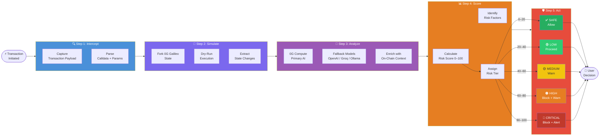

# Solution

> **⚡ TL;DR**
> SIFIX runs a **5-step safety check** on every transaction before you sign it: Intercept → Simulate → Analyze → Score → Act. It takes under 3 seconds and works like a **fire drill** — we run through the entire transaction to see exactly what would happen, without actually executing it. Then an AI explains the risks in plain English and either greenlights the transaction or warns you about the danger.

## The SIFIX Protection Pipeline

SIFIX protects users through a deterministic **5-step pipeline** that executes between the moment a user initiates a transaction and the moment they sign it. Every step runs locally or against a forked network — **no real transactions are ever executed during analysis**.

```
Intercept → Simulate → Analyze → Score → Act
```

The entire pipeline completes in **under 3 seconds** for standard transactions and **under 8 seconds** for complex multi-call DeFi operations.

---

## Pipeline Overview



---

## Step 1: Intercept

**Goal:** Capture the full transaction payload before it reaches the wallet's signing interface.

When a dApp initiates a transaction (via `eth_sendTransaction` or `personal_sign`), the SIFIX Chrome Extension intercepts the request using the Plasmo MV3 content script pipeline:

- **Capture raw payload** — `to`, `value`, `data`, `gas`, and all parameters
- **Parse calldata** — Decode function selectors and parameters using ABI matching
- **Identify interaction type** — Classify as ERC-20 transfer, approval, swap, multicall, proxy call, or unknown
- **Enrich with metadata** — Resolve ENS names, contract labels, and known address tags

The interception is **non-invasive** — it reads the transaction without modifying it or preventing the wallet from functioning normally.

---

## Step 2: Simulate

**Goal:** Execute the transaction in a sandboxed environment and extract all state changes.

> 🔥 **Think of it like a fire drill.** Before a real emergency happens, you practice the evacuation route to see where everyone would go and what would happen — without any actual danger. SIFIX does the same with your transaction: it runs through the *entire* execution on a copy of the blockchain to see exactly what would change, which tokens would move, and where they'd go — without ever submitting the real transaction.

SIFIX runs the captured transaction against a **forked 0G Galileo node** using `eth_call` and `trace` methods:

- **Fork current state** — Create a snapshot of the blockchain state at the current block
- **Dry-run execution** — Execute the transaction without broadcasting it
- **Extract state diff** — Identify every balance change, approval change, and contract storage modification
- **Trace internal calls** — Follow the execution path through all internal transactions and delegate calls
- **Estimate gas accurately** — Calculate true gas cost including internal operations

**Key principle:** The simulation is **read-only**. No transaction is ever submitted to the network during analysis. The forked state is discarded after the simulation completes.

**Simulation outputs include:**
- Token transfers (from → to, amount, token address)
- Approval changes (owner, spender, new allowance)
- Contract state modifications
- Event logs emitted
- Gas usage breakdown

---

## Step 3: Analyze

**Goal:** Apply AI-driven semantic analysis to understand the transaction's intent and identify threats.

The simulation output is passed to the AI analysis layer, which uses **0G Compute as the primary inference engine** with intelligent fallback to multiple AI providers:

**Primary: 0G Compute**
- On-chain AI inference optimized for blockchain data
- Lowest latency for on-chain analysis patterns
- Native integration with 0G Galileo infrastructure

**Fallback Chain:**
1. **OpenAI** (GPT-4 class) — Deep reasoning for complex transaction patterns
2. **Groq** (LPU inference) — Ultra-low latency for real-time scoring
3. **OpenRouter** — Model routing for specialized analysis tasks
4. **Ollama** (local) — Privacy-preserving offline analysis

**Analysis dimensions:**
- **Intent classification** — What is this transaction trying to accomplish?
- **Risk pattern matching** — Does this match known attack patterns (phishing, rug pull, approval scam)?
- **Counterparty analysis** — Is the receiving address known, flagged, or newly created?
- **Anomaly detection** — Is this transaction unusual for this user's historical behavior?
- **Contextual enrichment** — Cross-reference with on-chain data (contract age, liquidity, holder distribution)

---

## Step 4: Score

**Goal:** Synthesize all analysis into a single actionable risk score.

> **Think of it like a credit score for transactions.** Just as a credit score condenses your financial history into a single number that tells a lender "safe" or "risky," SIFIX condenses dozens of security checks into a 0–100 score that tells you at a glance whether a transaction is safe to sign.

Every transaction receives a **composite risk score from 0 to 100**, calculated from weighted risk factors identified during analysis:

### Risk Tiers

| Tier | Score | Color | Description | Action |
|---|---|---|---|---|
| **SAFE** | 0–20 | 🟢 Green | Standard, well-understood interaction with verified contracts | ✅ Allow — show minimal notification |
| **LOW** | 20–40 | 🟢 Light Green | Minor concerns — new contract, small amount to unverified address | ✅ Proceed — show brief summary |
| **MEDIUM** | 40–60 | 🟡 Yellow | Notable risks — unusual approval, unverified contract, large transfer | ⚠️ Warn — require explicit confirmation with risk breakdown |
| **HIGH** | 60–80 | 🟠 Orange | Major risks — pattern matches known scams, unlimited approval to unknown address | 🚫 Block — prevent signing, show detailed threat report |
| **CRITICAL** | 80–100 | 🔴 Red | Imminent threat — confirmed malicious contract, active phishing campaign, clear drain pattern | 🚫 Block — prevent signing, trigger alert to connected devices |

**Scoring factors include:**
- Contract verification status and audit history
- Approval magnitude (limited vs. unlimited)
- Counterparty reputation and flag status
- Transaction pattern anomaly score
- Token legitimacy and liquidity analysis
- Historical interaction frequency with target address
- Time-weighted threat intelligence (recent scam patterns)

---

## Step 5: Act

**Goal:** Present the analysis to the user in the most appropriate way for the risk level.

Based on the assigned risk tier, SIFIX takes proportionate action:

- **SAFE / LOW** — A non-intrusive notification appears in the extension popup showing the simulation summary and AI confidence score. The user proceeds normally.
- **MEDIUM** — An expanded warning panel appears with the full simulation breakdown, identified risk factors, and a plain-English explanation. The user must explicitly acknowledge the risks before proceeding.
- **HIGH / CRITICAL** — The transaction is blocked from signing. A full threat report is displayed with:
  - Every identified risk factor with severity
  - Simulation state diff showing exactly what would change
  - AI-generated explanation of the attack vector
  - Recommended actions (revoke approvals, check device security)
  - Option to override (at the user's explicit risk)

**The user always retains final control.** SIFIX never prevents a user from signing a transaction they explicitly choose to proceed with — but it ensures they do so with full knowledge of the risks.

---

## Zero-Knowledge Approach

SIFIX operates on a strict principle: **simulate, never execute.**

> **Think of SIFIX as a safety inspector, not a driver.** A car inspector can tell you everything about a vehicle's condition — but they never drive it off the lot. Similarly, SIFIX reads and analyzes your transactions but has **zero ability** to move your money, sign anything, or act on your behalf.

- ✅ **Does:** Read transaction payloads, simulate on forked state, analyze with AI, present risk reports
- ❌ **Does NOT:** Hold private keys, submit transactions, modify wallet state, store sensitive data, require custody

The system is designed to be a **read-only advisor** that sits between the dApp and the wallet. It has zero ability to move funds, sign transactions, or interact with contracts on behalf of the user.

All analysis data is stored locally in the extension's IndexedDB (via Dexie) and the dApp's SQLite database (via Prisma). No transaction details, wallet addresses, or simulation results are sent to external services beyond what's required for AI inference.

---

## Performance

| Metric | Target | Typical |
|---|---|---|
| Simple transfer analysis | < 2s | ~1.2s |
| ERC-20 approval analysis | < 3s | ~2.1s |
| Complex DeFi interaction | < 8s | ~5.5s |
| AI model fallback switch | < 500ms | ~200ms |
| Extension popup load | < 500ms | ~300ms |

---

## Summary

SIFIX's 5-step pipeline transforms the transaction signing experience from **blind trust** to **informed consent**. By combining on-chain simulation with multi-model AI analysis, it provides the semantic understanding that traditional wallets lack — without ever taking custody of user funds.

→ **Next:** [Tech Stack](./tech-stack) — The technologies that power each step of the pipeline.
