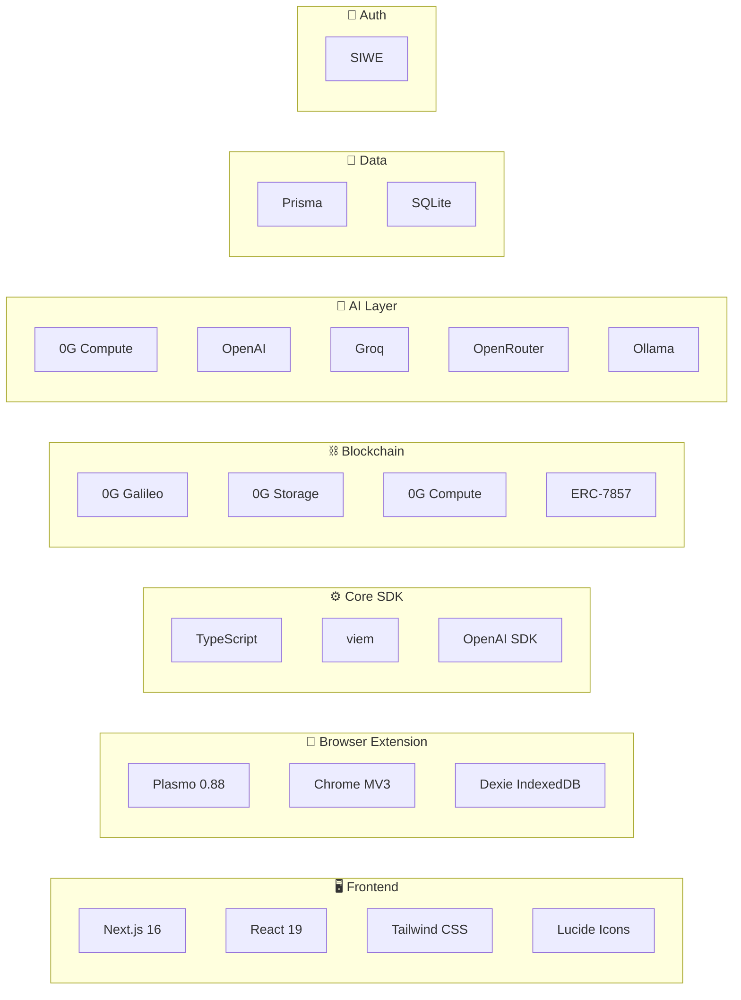

# Tech Stack

SIFIX is built as a modular system across three repositories, each with a focused technology stack optimized for its role in the security pipeline.

---

## Architecture Overview



---

## Frontend — sifix-dapp

The SIFIX dashboard is the primary interface for transaction history, risk reports, portfolio security insights, and account management.

- **Next.js 16** — App Router with Server Components
- **React 19** — Latest concurrent features for responsive UI
- **Tailwind CSS** — Utility-first styling with custom SIFIX theme
- **Lucide Icons** — Consistent, lightweight icon system
- **35 API Routes** — RESTful endpoints for simulation, analysis, history, and settings
- **12 Pages** — Dashboard, transactions, risk reports, settings, auth, and more

### Why Next.js 16?

Next.js provides the best balance of developer experience and performance for a full-stack dApp:

- **Server Components** reduce client-side JavaScript for faster page loads
- **API Routes** eliminate the need for a separate backend — the 35 API routes handle all data operations, simulation requests, and AI orchestration directly within the Next.js server layer
- **App Router** enables nested layouts for the dashboard structure (sidebar, header, content area) without prop drilling or complex state management
- **Built-in optimization** for images, fonts, and scripts keeps the dashboard performant even with complex risk visualization components

### Why React 19?

React 19's concurrent rendering and `useTransition` are critical for the dashboard's UX:

- Risk analysis results stream in progressively — the UI doesn't freeze while waiting for AI inference
- `useOptimistic` enables instant feedback when users submit simulation requests
- Server Components reduce the hydration payload, improving time-to-interactive on the risk report pages

### Why Tailwind CSS?

Security dashboards need to display complex information hierarchies — risk tiers, severity indicators, nested transaction breakdowns. Tailwind's utility approach lets us build these components with precise control over spacing, color, and responsive behavior without fighting a CSS framework's opinionated defaults.

The custom SIFIX theme maps directly to risk tiers: `risk-safe` (green), `risk-low` (teal), `risk-medium` (yellow), `risk-high` (orange), `risk-critical` (red).

---

## Browser Extension — sifix-extension

The Chrome extension is the real-time protection layer, intercepting transactions at the wallet interface.

- **Plasmo 0.88** — The framework for building Chrome extensions with React
- **Chrome Manifest V3** — Google's latest extension standard, required for Chrome Web Store
- **Dexie IndexedDB** — Client-side database for transaction history and settings

### Why Plasmo?

Building a Chrome extension with raw MV3 APIs involves managing background service workers, content scripts, popup UI, and messaging — all with different build configurations and lifecycle rules. Plasmo solves this:

- **React-first development** — The popup, options page, and content scripts are all React components
- **HMR in the extension** — Live-reload during development without manually refreshing the extension
- **Automatic manifest generation** — Plasmo generates `manifest.json` from code annotations
- **Built-in messaging** — Type-safe communication between content scripts and background service worker

### Why Manifest V3?

MV3 is mandatory for all new Chrome extensions as of 2024:

- **Service workers** replace persistent background pages — better resource efficiency
- **Stricter CSP** — Enhanced security for the extension itself (preventing XSS in the security tool would be embarrassing)
- **Action API** — Unified browser action and page action into a single `chrome.action` API
- **Offscreen documents** — Required for running simulation logic outside the main thread

### Why Dexie?

IndexedDB is the only persistent storage available to Chrome extensions, but its native API is callback-based and verbose. Dexie provides:

- **Promise-based API** — `await db.transactions.add(tx)` instead of nested callbacks
- **Type-safe schemas** — Compile-time checking on transaction and report storage
- **Reactive queries** — `useLiveQuery` hooks that auto-update the popup UI when new transactions are intercepted
- **Multi-entry indexes** — Efficient queries on transaction history by address, date, risk tier, or token

---

## Core SDK — sifix-agent

The SDK is the heart of SIFIX — the simulation engine, AI routing, and risk scoring logic.

- **TypeScript** — Full type safety across the entire pipeline
- **viem** — Modern TypeScript library for Ethereum interactions
- **OpenAI SDK** — AI model communication with structured output parsing

### Why TypeScript?

TypeScript is non-negotiable for a security tool:

- **Transaction parsing** — viem's ABI decoder returns fully typed objects. No `any` types, no runtime surprises when parsing calldata
- **Risk scoring** — The scoring pipeline is a chain of typed functions where each step's output is the next step's input. TypeScript catches mismatches at compile time
- **Cross-repo consistency** — The SDK types are shared with the dApp and extension, ensuring all three layers agree on data structures

### Why viem?

viem was chosen over ethers.js for the SDK layer:

- **Tree-shakeable** — The SDK only imports the functions it uses (ABICoder, `eth_call`, trace methods). In the extension where bundle size matters, this keeps the build small
- **No provider abstraction** — viem's `publicClient` is a thin wrapper over JSON-RPC. Direct access to `eth_call` and `debug_traceTransaction` without fighting a provider abstraction layer
- **Better TypeScript inference** — ABI-typed contract methods return exact types, not `BigNumber` or `string`
- **Modular** — Can import just the simulation utilities without pulling in wallet/signing code

### Why OpenAI SDK?

The OpenAI SDK is used as the primary client for **all** AI providers — not just OpenAI:

- **Structured outputs** — The `zod` integration ensures AI responses conform to the `RiskAnalysis` schema at parse time
- **Streaming** — Progressive display of analysis results in the dashboard while inference is running
- **Provider-agnostic interface** — The SDK's chat completion API maps cleanly to Groq, OpenRouter, and Ollama endpoints with minimal adaptation

---

## Blockchain — 0G Galileo Testnet

SIFIX is built natively on the **0G Galileo Testnet** — not deployed as a generic EVM dApp.

- **0G Galileo Testnet** — Chain ID `16602`
- **0G Storage** — Data availability layer for simulation reports and risk data
- **0G Compute** — On-chain AI inference (primary analysis engine)
- **ERC-7857** — Asset tokenization standard
- **Contract:** `0x2700F6A3e505402C9daB154C5c6ab9cAEC98EF1F`
- **Token ID:** `99`

### Why 0G Galileo?

0G is not just another EVM chain — it's built for AI-native applications:

- **0G Compute** provides on-chain AI inference that SIFIX uses as its primary analysis engine. This means the AI model runs within the 0G infrastructure, reducing latency and eliminating the need for external API calls for most analyses
- **0G Storage** provides a data availability layer where SIFIX can persist simulation reports, risk assessments, and threat intelligence in a verifiable, on-chain manner
- **EVM compatibility** means SIFIX can use standard Ethereum tooling (viem, Foundry, Hardhat) while accessing AI capabilities that no other chain provides
- **ERC-7857** support enables tokenization of security assets and risk positions

**Network details:**
- **Chain ID:** `16602`
- **RPC:** Available through 0G Galileo testnet endpoints
- **Explorer:** 0G Galileo block explorer
- **Faucet:** Available through the 0G community for testnet tokens

---

## AI Layer

SIFIX uses a **tiered AI architecture** with intelligent model routing:

- **0G Compute** — Primary inference engine for on-chain analysis
- **OpenAI** (GPT-4 class) — Deep reasoning fallback for complex patterns
- **Groq** — Ultra-low latency LPU inference for real-time scoring
- **OpenRouter** — Multi-model routing for specialized tasks
- **Ollama** — Local model fallback for privacy-sensitive scenarios

### Why Multi-Model?

No single AI model is optimal for every transaction type:

- **Simple transfers** need fast, cheap analysis — Groq's LPU inference handles these in under 200ms
- **Complex DeFi interactions** need deep reasoning about multi-step execution paths — GPT-4 class models on OpenAI or OpenRouter provide the analysis depth
- **Known attack patterns** can be classified efficiently by 0G Compute's on-chain models without any external API call
- **Privacy scenarios** — Some users prefer that no transaction data leaves their device. Ollama runs analysis locally using open-source models

The SDK's AI router automatically selects the optimal model based on:
1. Transaction complexity (calldata depth, number of internal calls)
2. User privacy preferences
3. Model availability (fallback chain if primary is down)
4. Latency requirements (timeout budget per analysis step)

---

## Database

- **Prisma** — Type-safe ORM with migration support
- **SQLite** — Lightweight, serverless, embedded database

### Why Prisma + SQLite?

The SIFIX dApp needs structured storage for transaction history, user preferences, risk reports, and analysis metadata — but it doesn't need a separate database server:

- **SQLite is embedded** — Zero configuration, zero server maintenance, works in any deployment environment (Vercel, Docker, local dev)
- **Prisma provides type safety** — The schema definition in `schema.prisma` generates TypeScript types that flow through the entire application
- **Migrations are declarative** — `prisma migrate dev` handles schema changes without manual SQL
- **Prisma Studio** — Built-in admin UI for inspecting data during development

---

## Authentication

- **SIWE (Sign-In with Ethereum)** — Wallet-based authentication

### Why SIWE?

SIFIX is a Web3-native tool — traditional email/password authentication is antithetical to the product's philosophy:

- **Wallet = identity** — Users authenticate by signing a message with their wallet. No passwords, no email verification, no account recovery flows
- **EIP-4361 standard** — SIWE is the emerging standard for wallet-based auth, supported by every major wallet
- **Session management** — The dApp creates a server-side session from the SIWE signature, enabling authenticated API calls to the 35 route handlers
- **No personal data** — SIWE requires nothing beyond a wallet address. No email, no name, no personal information collected

---

## Complete Dependency Map

```
sifix-dapp/
├── next@16
├── react@19
├── tailwindcss
├── lucide-react
├── prisma
├── better-sqlite3
├── siwe (Sign-In with Ethereum)
├── viem
└── @sifix/sdk (workspace link)

sifix-extension/
├── plasmo@0.88
├── react@19
├── dexie (IndexedDB)
├── viem
└── @sifix/sdk (workspace link)

sifix-agent/ (SDK)
├── typescript@5.x
├── viem
├── openai (multi-provider client)
├── zod (schema validation)
└── 0g-sdk (0G Galileo integration)
```

---

→ **Next:** [Architecture](../architecture/) — How these technologies connect in the system design.
