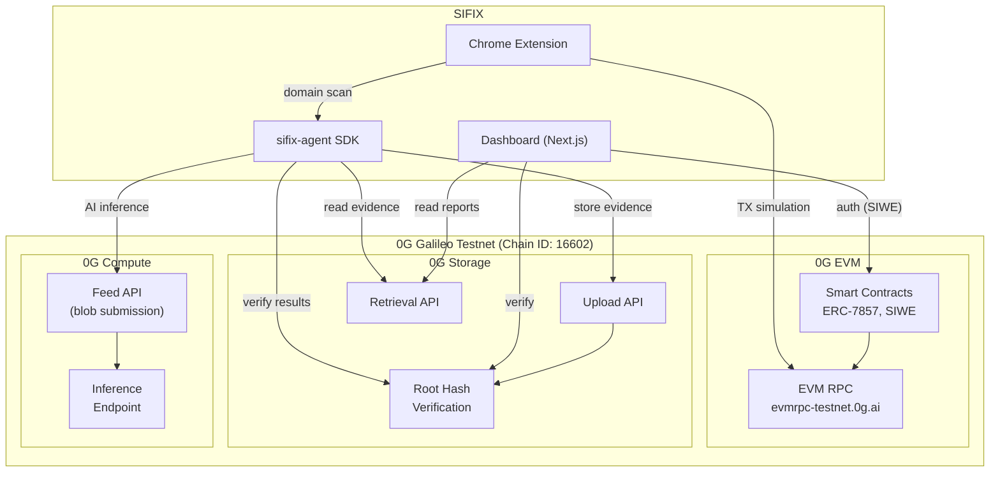

# 0G Integration

SIFIX is built natively on the **0G (ZeroGravity) ecosystem**, leveraging three core services: **0G Storage** for immutable evidence, **0G Compute** for decentralized AI inference, and **0G EVM** for smart contract deployment and authentication. All services run on the **0G Galileo Testnet** (Chain ID: 16602).

---

## Service Interaction Overview



---

## Network Configuration

| Parameter | Value |
|-----------|-------|
| **Network Name** | 0G Galileo Testnet |
| **Chain ID** | `16602` |
| **RPC URL** | `https://evmrpc-testnet.0g.ai` |
| **Explorer** | [https://chainscan-galileo.0g.ai](https://chainscan-galileo.0g.ai) |
| **Currency** | 0G Token |

### Adding to MetaMask

```json
{
  "chainId": "0x40DA",
  "chainName": "0G Galileo Testnet",
  "nativeCurrency": { "name": "0G Token", "symbol": "0G", "decimals": 18 },
  "rpcUrls": ["https://evmrpc-testnet.0g.ai"],
  "blockExplorerUrls": ["https://chainscan-galileo.0g.ai"]
}
```

---

## 0G Storage

0G Storage provides **decentralized, immutable** data storage. SIFIX uses it to permanently store security analysis evidence — ensuring that audit results cannot be altered after the fact.

### SDK

SIFIX uses the official TypeScript SDK for 0G Storage interactions:

```
@0gfoundation/0g-storage-ts-sdk
```

### How SIFIX Uses 0G Storage

**Evidence Upload:**
Every completed security scan produces a `SecurityReport` that is serialized to JSON and uploaded to 0G Storage. The upload returns a **root hash** — a cryptographic commitment to the stored data.

```typescript
import { StorageClient } from "@0gfoundation/0g-storage-ts-sdk";

const storageClient = new StorageClient({
  rpcUrl: "https://evmrpc-testnet.0g.ai",
  chainId: 16602
});

// Upload analysis evidence
const receipt = await storageClient.upload({
  data: JSON.stringify(securityReport),
  tags: [`sifix:${securityReport.scanId}`, `evidence`]
});

console.log("Root Hash:", receipt.rootHash);
// This root hash is the immutable proof that this analysis existed
```

**Evidence Retrieval:**
Reports can be retrieved at any time using the root hash:

```typescript
const evidence = await storageClient.download(receipt.rootHash);
const report = JSON.parse(evidence.data);

// Verify integrity
const isValid = await storageClient.verify(receipt.rootHash, evidence.data);
console.log("Evidence valid:", isValid); // true
```

### Root Hash Verification

The root hash is the cornerstone of evidence integrity. It provides:

- **Immutability** — The data cannot be changed without invalidating the root hash
- **Verifiability** — Anyone can verify that stored data matches a given root hash
- **Portability** — The root hash can be shared independently of the data itself
- **Permanence** — Data stored on 0G Storage persists on-chain

The verification flow:

1. Retrieve the root hash from the security report or dashboard
2. Download the evidence data from 0G Storage
3. Compute the hash of the downloaded data
4. Compare against the stored root hash
5. If they match, the evidence is authentic and unaltered

---

## 0G Compute

0G Compute provides **decentralized AI inference** capabilities. SIFIX uses it as the primary AI provider for security analysis, with automatic fallback handling.

### How SIFIX Uses 0G Compute

The AI analysis pipeline works in two stages:

#### Stage 1: Feed (Blob Submission)

The analysis payload is prepared as a structured blob and submitted to the 0G Compute feed endpoint.

```typescript
// Prepare analysis payload
const payload = {
  type: "security-analysis",
  version: "1.5.0",
  input: {
    transaction: transactionData,
    simulation: simulationResults,
    threatIntel: aggregatedThreats,
    addressHistory: historicalData
  },
  options: {
    temperature: 0.1,
    max_tokens: 2048
  }
};

// Submit to 0G Compute feed
const feedResult = await zeroGCompute.submitFeed({
  model: "security-analyzer-v2",
  blob: JSON.stringify(payload)
});
// feedResult.feedId — reference for inference retrieval
```

#### Stage 2: Inference

After the feed is processed, the inference endpoint is queried for results.

```typescript
// Poll for inference results
const inference = await zeroGCompute.getInference({
  feedId: feedResult.feedId,
  timeout: 10000 // 10-second timeout
});

if (inference.status === "completed") {
  const analysis = JSON.parse(inference.output);
  // analysis: { riskScore, threatType, explanation, confidence }
}
```

### Fallback Handling

If 0G Compute fails for any reason, the pipeline gracefully degrades:

```typescript
try {
  // Primary: 0G Compute
  analysis = await zeroGCompute.infer(payload);
} catch (error) {
  // Fallback: Local lightweight model
  analysis = await localModel.infer(payload);
}
```

**Fallback Triggers:**
- 0G Compute endpoint unreachable
- Inference timeout exceeded (10 seconds)
- Invalid or malformed inference response
- Network connectivity issues

**Fallback Behavior:**
- Uses a lightweight local model for basic risk assessment
- Analysis is flagged as "fallback inference" in the report
- Reduced confidence score to reflect the simpler model
- Evidence still stored on 0G Storage

---

## 0G EVM

The 0G EVM provides a fully EVM-compatible execution environment. SIFIX uses it for smart contract deployment and authentication.

### Smart Contracts

SIFIX deploys the following contracts on 0G Galileo Testnet:

**ERC-7857 Agentic Identity**
- Address: `0x2700F6A3e505402C9daB154C5c6ab9cAEC98EF1F`
- Purpose: On-chain identity for the SIFIX AI agent
- See [Agentic Identity](./agentic-identity.md) for full details

**SIWE Authentication Contract**
- Purpose: Manages Sign-In with Ethereum sessions
- Validates SIWE messages and issues session tokens
- Tracks active sessions for the dashboard and extension

### SIWE (Sign-In with Ethereum) Auth

The authentication flow leverages 0G EVM for message verification:

```typescript
// 1. Generate SIWE message
const message = new SiweMessage({
  domain: "app.sifix.io",
  address: walletAddress,
  statement: "Sign in to SIFIX Dashboard",
  uri: "https://app.sifix.io",
  version: "1",
  chainId: 16602,
  nonce: generateNonce()
});

// 2. User signs the message via their wallet
const signature = await wallet.signMessage(message.prepareMessage());

// 3. Backend verifies on 0G EVM
const verified = await siweBackend.verify({
  message,
  signature,
  rpcUrl: "https://evmrpc-testnet.0g.ai"
});

// 4. Issue JWT
if (verified) {
  const token = jwt.sign({ address: walletAddress }, JWT_SECRET, { expiresIn: "24h" });
}
```

### Transaction Simulation

The extension uses 0G EVM's RPC for transaction simulation via `eth_call` and trace methods:

```typescript
// Simulate a transaction without broadcasting
const result = await provider.call({
  from: userAddress,
  to: contractAddress,
  data: calldata,
  value: value
}, "latest");
```

---

## RPC Configuration

The primary RPC endpoint for all SIFIX interactions with 0G Galileo Testnet:

```
https://evmrpc-testnet.0g.ai
```

### Usage in SIFIX Components

```typescript
// Agent configuration
const agent = new SecurityAgent({
  rpcUrl: "https://evmrpc-testnet.0g.ai",
  chainId: 16602
});

// viem provider setup
import { createPublicClient, http } from "viem";

const client = createPublicClient({
  chain: zeroGGalileoTestnet,
  transport: http("https://evmrpc-testnet.0g.ai")
});

// 0G Storage client
const storage = new StorageClient({
  rpcUrl: "https://evmrpc-testnet.0g.ai",
  chainId: 16602
});
```

---

## Explorer

All on-chain activity can be monitored through the 0G Galileo Testnet explorer:

**🔗 [https://chainscan-galileo.0g.ai](https://chainscan-galileo.0g.ai)**

### Useful Explorer Links

- **Agentic Identity Contract**: [View Contract](https://chainscan-galileo.0g.ai/address/0x2700F6A3e505402C9daB154C5c6ab9cAEC98EF1F)
- **Agent Owner**: [View Address](https://chainscan-galileo.0g.ai/address/0x3b7D569a)
- **Recent Transactions**: [View Latest Blocks](https://chainscan-galileo.0g.ai)

---

## Integration Summary

| 0G Service | SIFIX Usage | SDK / Method |
|------------|-------------|--------------|
| **0G Storage** | Immutable evidence storage | `@0gfoundation/0g-storage-ts-sdk` |
| **0G Compute** | AI inference (primary) | Feed API + Inference endpoint |
| **0G EVM** | Smart contracts, SIWE auth, TX simulation | viem + `eth_call` |
| **RPC** | All on-chain interactions | `https://evmrpc-testnet.0g.ai` |
| **Explorer** | On-chain verification & monitoring | `https://chainscan-galileo.0g.ai` |

---

## Related

- [AI Agent](./ai-agent.md) — Uses all three 0G services in its pipeline
- [Agentic Identity](./agentic-identity.md) — The on-chain identity deployed on 0G EVM
- [Chrome Extension](./extension.md) — TX simulation via 0G EVM RPC
- [Dashboard](./dashboard.md) — SIWE authentication and evidence viewing
