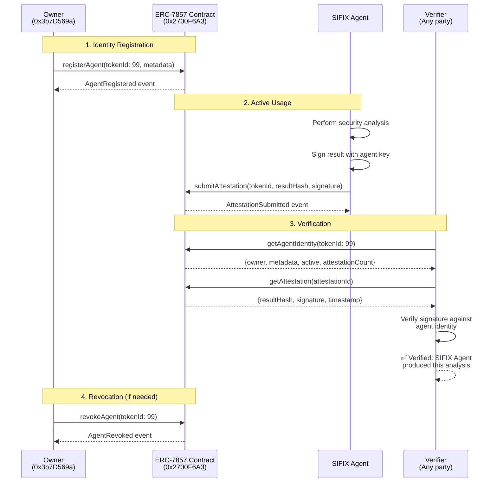

# Agentic Identity

SIFIX's AI agent possesses a verifiable **on-chain identity** through **ERC-7857 (Agentic ID)** — an experimental standard for giving autonomous AI agents a cryptographically provable identity on-chain. This identity allows the agent to sign analysis results, establish trust, and be held accountable for its security verdicts.

---

## Identity Details

| Property | Value |
|----------|-------|
| **Standard** | ERC-7857 Agentic ID |
| **Contract** | `0x2700F6A3e505402C9daB154C5c6ab9cAEC98EF1F` |
| **Token ID** | `99` |
| **Owner** | `0x3b7D569a…` |
| **Network** | 0G Galileo Testnet |
| **Chain ID** | 16602 |
| **Explorer** | [View on 0G Chainscan](https://chainscan-galileo.0g.ai) |

---

## What It Means

Traditional Web3 security tools operate as faceless services — users have no way to verify *who* or *what* produced a particular security analysis. ERC-7857 changes this by giving the SIFIX agent an **on-chain identity** that:

- **Can sign analysis results** — Every security report can be cryptographically verified as originating from the SIFIX agent
- **Has a verifiable owner** — The identity is controlled by a known Ethereum address, establishing accountability
- **Is persistent and immutable** — The identity exists on-chain permanently and cannot be forged
- **Enables trust chains** — Other agents and contracts can verify the SIFIX agent's identity before accepting its analysis
- **Supports revocation** — If the agent is compromised, the owner can revoke the identity

In practice, this means that when the SIFIX agent flags a contract as malicious or verifies a domain as safe, these verdicts carry the weight of a cryptographically signed, on-chain identity — not just an anonymous API response.

---

## How It Works

### Identity Lifecycle



---

## Identity Registration

The agent identity was registered by the owner address through the ERC-7857 contract:

```solidity
// Register the SIFIX agent
erc7857.registerAgent(
    tokenId: 99,
    metadata: {
        name: "SIFIX Security Agent",
        version: "1.5.0",
        capabilities: ["security-analysis", "threat-detection", "transaction-simulation"],
        network: "0g-galileo-testnet"
    }
);
```

Once registered, the agent receives a unique signing key that is linked to the on-chain identity. This key is used to sign all analysis results.

---

## Signing Analysis Results

When the SIFIX agent completes a security scan, it signs the result before storing it:

```typescript
// After analysis is complete
const analysisResult = {
  scanId: "scan_0xabc123",
  verdict: "danger",
  riskScore: 87,
  threats: [...],
  timestamp: Date.now()
};

// Sign with the agent's on-chain identity
const signature = await agentIdentity.sign(analysisResult);

// Store on 0G Storage with the signature attached
const evidence = {
  ...analysisResult,
  agentSignature: signature,
  agentTokenId: 99,
  agentContract: "0x2700F6A3e505402C9daB154C5c6ab9cAEC98EF1F"
};
```

---

## Verification Process

Any third party can verify that a security report was genuinely produced by the SIFIX agent:

### Step 1: Retrieve the Report

Fetch the report from 0G Storage using the root hash.

### Step 2: Verify On-Chain Identity

Query the ERC-7857 contract to confirm:
- Token ID `99` is a valid, active agent identity
- The identity has not been revoked
- The reported contract address matches `0x2700F6A3e505402C9daB154C5c6ab9cAEC98EF1F`

### Step 3: Verify the Signature

```typescript
const isValid = await erc7857.verifyAttestation({
    tokenId: 99,
    dataHash: keccak256(reportData),
    signature: report.agentSignature
});
// isValid === true → Confirmed: SIFIX Agent produced this analysis
```

### Step 4: Check Attestation Record

Query the contract for the attestation record to confirm the timestamp and details match.

---

## Trust Model

The Agentic ID establishes a multi-layered trust model:

**Layer 1 — Owner Trust**
The agent identity is owned by `0x3b7D569a`. This address is publicly known and associated with the SIFIX project. Users trust this address to operate the agent honestly.

**Layer 2 — Contract Trust**
The ERC-7857 contract enforces that only the owner can register, update, or revoke agent identities. The contract code is immutable and verifiable on the 0G Galileo Testnet explorer.

**Layer 3 — Cryptographic Trust**
Every analysis result is signed with a key linked to the on-chain identity. The signature is verifiable by anyone without trusting a central authority.

**Layer 4 — Evidence Trust**
Signed analysis results are stored immutably on 0G Storage. The root hash serves as permanent proof that the analysis existed at a specific point in time.

---

## On-Chain Verification

To verify the SIFIX agent identity directly on-chain:

```bash
# Using cast (foundry)
cast call 0x2700F6A3e505402C9daB154C5c6ab9cAEC98EF1F \
  "getAgentIdentity(uint256)(address,bool,uint256)" 99 \
  --rpc-url https://evmrpc-testnet.0g.ai

# Returns: (owner, isActive, attestationCount)
```

Or view directly on the explorer:
- **Contract**: [https://chainscan-galileo.0g.ai/address/0x2700F6A3e505402C9daB154C5c6ab9cAEC98EF1F](https://chainscan-galileo.0g.ai/address/0x2700F6A3e505402C9daB154C5c6ab9cAEC98EF1F)
- **Token**: [https://chainscan-galileo.0g.ai/token/99](https://chainscan-galileo.0g.ai/token/99)

---

## Technical Specifications

| Property | Value |
|----------|-------|
| Standard | ERC-7857 (Agentic ID) |
| Contract Address | `0x2700F6A3e505402C9daB154C5c6ab9cAEC98EF1F` |
| Token ID | 99 |
| Owner | `0x3b7D569a…` |
| Network | 0G Galileo Testnet |
| Chain ID | 16602 |
| Signing Algorithm | ECDSA (secp256k1) |
| Signature Type | EIP-712 typed data |

---

## Related

- [AI Agent](./ai-agent.md) — The security engine that holds this identity
- [0G Integration](./0g-integration.md) — Storage and compute infrastructure
- [Dashboard](./dashboard.md) — View agent identity status and attestation history
