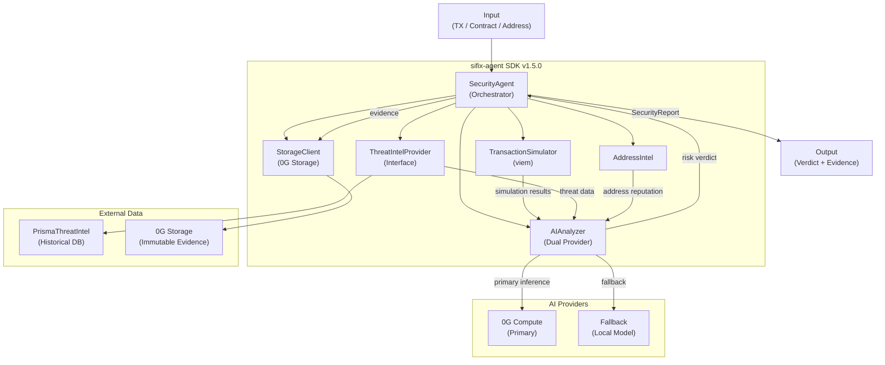

# AI Agent

> **TL;DR** — The brain behind SIFIX. It simulates transactions, runs AI analysis, checks threat databases, and stores tamper-proof evidence on-chain — all through a modular SDK you can plug into any app.

**In Plain English:** Think of the AI Agent as a security auditor that never sleeps. When you scan a contract or send a transaction, this agent simulates what would happen, asks an AI model to assess the risk, cross-references past threat data, and then stamps the result with cryptographic proof on 0G Storage — so nobody can dispute the verdict later.

The **sifix-agent SDK** (v1.5.0) is the core intelligence engine behind SIFIX. It orchestrates transaction simulation, AI-powered risk analysis, threat intelligence aggregation, and immutable evidence storage — all through a modular, extensible pipeline.

---

## Architecture Overview



---

## Modules

### 1. SecurityAgent (Orchestrator)

The central orchestrator that coordinates all analysis modules. It receives scan requests, manages the pipeline execution order, and produces the final security report.

**Responsibilities:**
- Accept scan requests (transaction, contract, or address)
- Determine which modules to invoke based on input type
- Manage pipeline execution with timeout and error handling
- Aggregate results from all modules into a unified `SecurityReport`
- Submit evidence to 0G Storage via the StorageClient
- Return the final verdict with attached evidence hash

**Configuration:**
```typescript
const agent = new SecurityAgent({
  simulator: { enabled: true, timeout: 10000 },
  ai: { provider: "0g-compute", fallback: true },
  storage: { network: "galileo-testnet" },
  threatIntel: { maxHistory: 50 },
  mock: false
});
```

### 2. TransactionSimulator

Simulates transactions on a forked 0G Galileo Testnet using **viem** to predict outcomes before execution.

**Responsibilities:**
- Fork the current chain state at the latest block
- Simulate `eth_sendTransaction` calls
- Trace token transfers and approval changes
- Estimate gas consumption with safety margins
- Detect reverts and out-of-gas conditions
- Identify internal contract calls

**Key Methods:**
```typescript
const simulator = new TransactionSimulator({
  rpcUrl: "https://evmrpc-testnet.0g.ai",
  chainId: 16602
});

const result = await simulator.simulate({
  from: "0x...",
  to: "0x...",
  data: "0x...",
  value: 0n
});
// result: { success, gasUsed, transfers, approvals, logs, revertReason }
```

### 3. AIAnalyzer (Dual Provider)

Performs AI-powered risk assessment using a dual-provider strategy with automatic fallback.

**Responsibilities:**
- Analyze transaction patterns for anomalous behavior
- Evaluate contract code for known vulnerability patterns
- Generate risk scores (0–100) with confidence levels
- Produce human-readable risk explanations
- Classify threat types (phishing, rug pull, honeypot, etc.)

**Dual Provider Strategy:**
1. **Primary**: 0G Compute — on-chain AI inference for decentralized analysis
2. **Fallback**: Local model — runs a lightweight model client-side if 0G Compute is unavailable

```typescript
const analyzer = new AIAnalyzer({
  provider: "0g-compute",
  fallback: true,
  mock: false
});

const analysis = await analyzer.analyze({
  transaction: txData,
  simulation: simResult,
  threatIntel: threatData,
  addressReputation: addressData
});
// analysis: { riskScore, threatType, explanation, confidence }
```

**Mock Mode:** When `mock: true`, the AIAnalyzer returns deterministic mock results for development and testing without requiring live AI inference.

### 4. StorageClient (0G Storage)

Handles immutable evidence storage on **0G Storage** using the `@0gfoundation/0g-storage-ts-sdk`.

**Responsibilities:**
- Upload analysis evidence (scan results, simulation data, AI verdicts)
- Verify data integrity via root hash confirmation
- Retrieve stored evidence for report verification
- Manage storage transactions on 0G Galileo Testnet

**Key Methods:**
```typescript
const storage = new StorageClient({
  rpcUrl: "https://evmrpc-testnet.0g.ai",
  chainId: 16602
});

const receipt = await storage.upload({
  data: JSON.stringify(securityReport),
  tags: ["sifix", "evidence", report.scanId]
});

// receipt.rootHash — immutable proof of storage
// Verify later:
const verified = await storage.verify(receipt.rootHash, securityReport);
```

### 5. ThreatIntelProvider (Interface)

An abstract interface for threat intelligence data sources. This modular design allows plugging in different providers (on-chain databases, external APIs, community feeds).

**Interface Definition:**
```typescript
interface ThreatIntelProvider {
  getThreatsForAddress(address: string): Promise<ThreatData[]>;
  getThreatsForDomain(domain: string): Promise<ThreatData[]>;
  getThreatsForContract(address: string): Promise<ThreatData[]>;
  reportThreat(threat: ThreatReport): Promise<void>;
}
```

**Built-in Implementation — PrismaThreatIntel:**
Uses Prisma ORM to query a local database of aggregated threat intelligence, providing fast lookups without external API dependencies.

### 6. AddressIntel

Provides address-based reputation scoring and historical activity analysis.

**Responsibilities:**
- Look up address reputation scores
- Aggregate historical transaction patterns
- Identify known exploiters, scammers, and verified entities
- Cross-reference with watchlist and tag data
- Provide first-seen and last-active timestamps

---

## Historical Learning

The agent incorporates a **historical learning** system powered by PrismaThreatIntel.

### How It Works

For every address analyzed, the system:

1. **Aggregates** the last **50 scan results** associated with that address
2. **Calculates** a composite reputation score based on:
   - Number of times flagged for threats
   - Severity distribution of past findings
   - Time since last incident
   - Community verification status
3. **Feeds** the historical context into the AIAnalyzer to improve risk assessment accuracy

```typescript
const historicalData = await prismaThreatIntel.getAggregatedHistory({
  address: "0x...",
  limit: 50
});

// historicalData: {
//   totalScans: 47,
//   threatCount: 3,
//   avgRiskScore: 12,
//   lastThreatDate: "2025-11-15",
//   reputationScore: 85
// }
```

This historical learning ensures that the agent's analysis improves over time as more data is collected, reducing false positives and increasing detection accuracy.

---

## 0G Compute Integration

The AIAnalyzer leverages **0G Compute** for decentralized AI inference:

### Inference Flow

1. **Prepare** the analysis payload as a structured blob
2. **Submit** to the 0G Compute feed endpoint
3. **Poll** the inference endpoint for results
4. **Parse** the AI response into a structured risk assessment
5. **Fallback** to local model if 0G Compute fails or times out (10-second threshold)

```typescript
// 0G Compute inference
const inference = await zeroGCompute.infer({
  model: "security-analyzer-v2",
  input: analysisPayload,
  options: { temperature: 0.1, max_tokens: 2048 }
});
```

---

## Mock Mode

For development and testing, the entire agent pipeline can run in **mock mode**:

```typescript
const agent = new SecurityAgent({
  mock: true,
  // All modules respect mock mode
});
```

**Mock Mode Behavior:**

| Module | Mock Behavior |
|--------|---------------|
| TransactionSimulator | Returns deterministic simulation results |
| AIAnalyzer | Returns pre-configured risk scores and explanations |
| StorageClient | Returns fake root hashes (no on-chain interaction) |
| ThreatIntelProvider | Returns sample threat data |
| AddressIntel | Returns static reputation scores |

This enables full end-to-end testing of the dashboard and extension without requiring:
- Live 0G Compute inference
- On-chain transactions
- Real threat intelligence data

---

## Output: SecurityReport

Every scan produces a standardized `SecurityReport`:

```typescript
interface SecurityReport {
  scanId: string;
  timestamp: string;
  target: {
    type: "transaction" | "contract" | "address" | "domain";
    identifier: string;
  };
  verdict: "safe" | "caution" | "danger";
  riskScore: number; // 0-100
  confidence: number; // 0-1
  threats: ThreatFinding[];
  simulation?: SimulationResult;
  aiAnalysis: AIAnalysisResult;
  evidence: {
    rootHash: string;
    storedAt: string;
    verified: boolean;
  };
  metadata: {
    scanDuration: number;
    modulesUsed: string[];
    mockMode: boolean;
  };
}
```

---

## Technical Specifications

| Property | Value |
|----------|-------|
| SDK Version | 1.5.0 |
| Language | TypeScript |
| Runtime | Node.js 20+, Browser |
| Simulation Engine | viem |
| AI Providers | 0G Compute (primary), Local (fallback) |
| Storage | @0gfoundation/0g-storage-ts-sdk |
| Database | Prisma (ThreatIntel) |
| Historical Window | Last 50 scans per address |
| Network | 0G Galileo Testnet (Chain ID: 16602) |

---

## Related

- [Chrome Extension](./extension) — Uses the agent for real-time analysis
- [Dashboard](./dashboard) — Agent configuration and monitoring
- [0G Integration](./0g-integration) — Storage and compute deep dive
- [Agentic Identity](./agentic-identity) — On-chain agent identity
