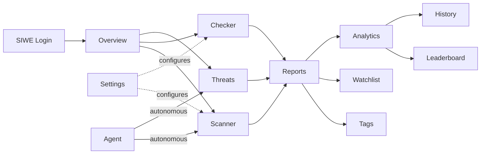

# SIFIX Dashboard

> **TL;DR** — A web app where you scan smart contracts, track threats, monitor your watchlist, and manage your AI security agent — all from one dark, glassmorphism-styled interface.

The SIFIX Dashboard is the central command center for managing your Web3 security posture. Built with **Next.js 16**, it provides comprehensive tools for scanning, monitoring, and responding to threats across the Web3 ecosystem on **0G Galileo Testnet**.

---

## Architecture Overview

---

## Design System

The dashboard follows a consistent **glassmorphism** design language across all pages.

### Color Palette

| Token | Hex | Usage |
|-------|-----|-------|
| **Background** | `#000000` | Pure black — all page backgrounds |
| **Surface** | `rgba(255,255,255,0.05)` | Frosted glass panels |
| **Border** | `rgba(255,255,255,0.1)` | Subtle glass borders |
| **Accent Blue** | `#3b9eff` | Primary actions, links, highlights |
| **Success** | `#22c55e` | Safe verdicts, positive metrics |
| **Warning** | `#f59e0b` | Caution states, medium-risk items |
| **Danger** | `#ef4444` | Critical threats, malicious domains |
| **Text Primary** | `#ffffff` | Headings and body text |
| **Text Secondary** | `#a1a1aa` | Muted labels and descriptions |

### Typography

- **Headings**: Playfair Display — elegant serif for page titles and section headers
- **Body**: Inter — clean sans-serif for UI elements, data tables, and descriptions
- **Code**: JetBrains Mono — monospace for addresses, hashes, and technical values

### Glassmorphism Pattern

All card and panel components use a consistent glass effect:

- Semi-transparent background (`rgba(255,255,255,0.05)`)
- Backdrop blur filter (`backdrop-filter: blur(12px)`)
- Subtle white border (`1px solid rgba(255,255,255,0.1)`)
- Soft box shadow (`0 8px 32px rgba(0,0,0,0.4)`)

---

## Pages

Below is a brief, plain-English description of each of the 12 dashboard pages:

- **Overview** — Your security homepage at a glance: a score out of 100, active threat count, recent scans, and quick-action cards.
- **Scanner** — The analysis workhorse. Paste a contract address, token, or domain and get a full security breakdown in seconds.
- **Checker** — A pre-flight check for transactions. Paste raw calldata, simulate it on-chain, and see exactly what would happen *before* you sign.
- **Threats** — A live feed of what's happening in Web3 right now: phishing campaigns, rug pulls, honeypots — filterable by severity.
- **Reports** — Your library of past security reports. Search, filter, export to PDF, or verify on-chain evidence.
- **Tags** — Color-coded labels you can slap on any address or contract (e.g. *suspicious*, *verified*, *personal*) for easy filtering later.
- **Watchlist** — Proactive monitoring. Add addresses or domains and get alerts when risk scores change or new threats are detected.
- **Analytics** — Live prediction review: recent AI decisions, false positives / false negatives, provider accuracy, action protection matrix, and outcome drill-down for demo and tuning.
- **Leaderboard** — Community rankings. See who's contributing the most scans, reports, and verifications.
- **History** — A full audit trail of everything you've done in SIFIX — scans, tags, logins, extension connections — searchable and exportable.
- **Settings** — Your profile, notification preferences, API keys, extension management, and network configuration.
- **Agent** — Command center for the SIFIX AI Agent. Toggle it on/off, configure scan frequency, view its activity log, and switch to mock mode for testing.

---

### 1. Overview

The landing page after authentication. Provides a high-level summary of your security posture.

**Features:**
- Security score gauge (0–100) with animated arc
- Active threats count with severity breakdown
- Recent scan history (last 10 scans)
- Watchlist status summary
- Quick-action cards for common tasks
- Network status indicator (0G Galileo Testnet connection)

### 2. Scanner

The core scanning interface for analyzing smart contracts, tokens, and dApp domains.

**Features:**
- **Contract Scanner** — Input any contract address for full security analysis
- **Token Scanner** — Analyze ERC-20/ERC-721 tokens for honeypots, rug pulls, and malicious code
- **Domain Scanner** — Check dApp URLs against threat databases
- **Batch Scan** — Queue multiple targets for sequential analysis
- Real-time progress indicator with stage breakdown:
  1. Static analysis
  2. Simulation (via viem)
  3. AI risk assessment
  4. Threat intelligence correlation
  5. Report generation

### 3. Checker

Pre-transaction verification tool that simulates transactions before execution.

**Features:**
- Paste or upload transaction calldata for analysis
- Simulate against current on-chain state
- Preview token transfers and approval changes
- Gas estimation with safety margins
- Approval spender analysis (identify suspicious approvals)
- Integration with the extension for real-time checking

### 4. Threats

Live threat intelligence feed showing current and emerging threats in the Web3 ecosystem.

**Features:**
- Real-time threat feed with auto-refresh
- Severity filtering (Critical, High, Medium, Low, Info)
- Threat categories:
  - 🎯 Phishing campaigns
  - 💰 Rug pulls
  - 🪤 Honeypot contracts
  - 🔓 Approval exploits
  - 🧪 Flash loan attacks
  - 🕵️ Impersonation scams
- Threat details panel with affected contracts and addresses
- One-click "Add to Watchlist" for monitoring

### 5. Reports

Comprehensive security reports generated from scans and analyses.

**Features:**
- Report library with search and filter
- Report types:
  - **Contract Audit Report** — Full smart contract analysis
  - **Token Safety Report** — Token risk assessment
  - **Domain Security Report** — dApp domain verification
  - **Transaction Analysis Report** — Post-transaction forensic analysis
- Export to PDF
- On-chain evidence verification (0G Storage root hash)
- Share reports via unique URL

### 6. Tags

Custom tagging system for organizing and categorizing addresses, contracts, and domains.

**Features:**
- Create, edit, and delete custom tags
- Apply tags to any scanned entity
- Color-coded tag categories
- Tag-based filtering across all dashboard pages
- Pre-built tag templates:
  - `verified` — Known legitimate contracts
  - `suspicious` — Requires monitoring
  - `avoid` — Known malicious
  - `personal` — User's own contracts
  - `watching` — Under observation

### 7. Watchlist

Proactive monitoring system for tracking specific addresses, contracts, and domains.

**Features:**
- Add any address, contract, or domain to the watchlist
- Automatic re-scanning at configurable intervals (1h, 6h, 24h)
- Alert configuration:
  - New threat detected
  - Risk score change
  - Contract modification
  - Liquidity change
- Notification channels: In-app, email (future), Telegram (future)
- Watchlist overview dashboard with status grid

### 8. Analytics

Data visualization and trend analysis for security metrics over time.

**Features:**
- **Security Score Trend** — Historical security score over 7/30/90 days
- **Threat Distribution** — Pie/bar charts of threat types encountered
- **Scan Volume** — Number of scans performed over time
- **Risk Heatmap** — Day/time analysis of when threats are most active
- **Top Threats** — Most frequently encountered threat vectors
- **Network Activity** — 0G Galileo Testnet interaction metrics
- Date range selector with preset options

### 9. Leaderboard

Community-driven security contribution rankings.

**Features:**
- Top contributors by:
  - Number of scans performed
  - Threats identified
  - Reports generated
  - Community verification actions
- Weekly and all-time views
- User rank and score display
- Badges and achievement icons
- Community goals and progress tracking

### 10. History

Complete audit trail of all SIFIX activities for the authenticated user.

**Features:**
- Chronological activity log
- Event types:
  - Scans initiated and completed
  - Threats detected
  - Reports generated
  - Tags created or applied
  - Watchlist modifications
  - Extension connection events
  - Authentication events
- Advanced filtering by event type, date range, and severity
- Export activity log as JSON or CSV
- Pagination with infinite scroll

### 11. Settings

User preferences and configuration management.

**Features:**
- **Profile** — Connected wallet address, display name, avatar
- **Notifications** — Alert preferences for threats and watchlist items
- **Security** — Session timeout, two-factor authentication
- **Extension** — Manage connected extension instances
- **API Keys** — Generate and manage API keys for programmatic access
- **Preferences** — Theme settings, default scan parameters, language
- **Network** — 0G Galileo Testnet connection status and RPC configuration
- **Data** — Export all user data, delete account

### 12. Agent

Configuration and monitoring interface for the SIFIX AI Agent.

**Features:**
- Agent status (Active / Idle / Disabled)
- Autonomous scan configuration:
  - Scan frequency
  - Target scope (watchlist only, all connected, custom)
  - Risk threshold for auto-reporting
- Agent activity log
- AI model configuration (provider, parameters)
- 0G Compute integration status
- Mock mode toggle for development/testing
- Historical learning statistics (scans analyzed, patterns learned)

---

## Authentication

The dashboard uses **Sign-In with Ethereum (SIWE)** for authentication:

1. User connects their wallet via the dashboard
2. A SIWE message is generated and presented for signing
3. The signed message is verified by the SIFIX backend
4. A JWT token is issued and stored securely
5. The token is refreshed automatically on expiry

All authenticated requests include the JWT in the `Authorization` header.

---

## Technical Specifications

| Property | Value |
|----------|-------|
| Framework | Next.js 16 |
| Rendering | App Router with SSR + Client Components |
| Styling | Tailwind CSS 4 + custom glassmorphism utilities |
| State Management | Zustand |
| Data Fetching | TanStack Query (React Query) |
| Authentication | SIWE (Sign-In with Ethereum) |
| Network | 0G Galileo Testnet (Chain ID: 16602) |
| Design Language | Glassmorphism on pure black (#000) |

---

## Related

- [Chrome Extension](./extension) — Browser-based security companion
- [AI Agent](./ai-agent) — The analysis engine behind the dashboard
- [0G Integration](./0g-integration) — On-chain storage and compute infrastructure
