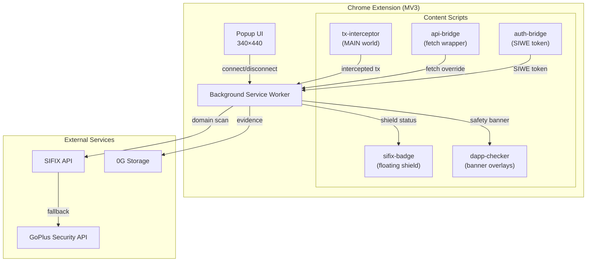
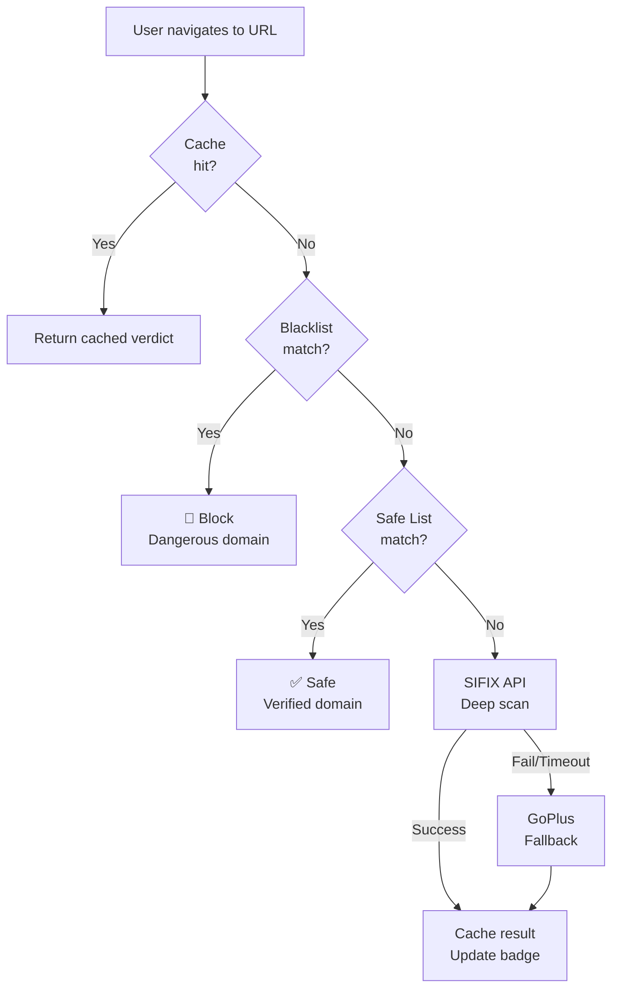

# Chrome Extension

The SIFIX Chrome Extension is the user-facing entry point for real-time Web3 wallet protection. Built on **Plasmo 0.88** with **Manifest V3**, it intercepts transactions, scans domains, and delivers instant security verdicts without leaving the browser.

---

## Architecture Overview



---

## Content Scripts

The extension injects **five content scripts** into web pages, each with a specific security responsibility.

### 1. tx-interceptor (MAIN World)

Runs in the page's **MAIN world** to gain direct access to `window.ethereum`. It proxies all transaction requests (`eth_sendTransaction`, `personal_sign`, etc.) through the SIFIX analysis pipeline before they reach the wallet.

- **Injection**: `MAIN` world via Plasmo content script config
- **Responsibilities**:
  - Intercept `eth_sendTransaction` calls
  - Capture `eth_signTypedData` and `personal_sign` requests
  - Forward transaction parameters to the background service worker for analysis
  - Block or allow based on the returned security verdict

### 2. api-bridge (Fetch Wrapper)

Wraps the global `fetch` API to monitor outgoing HTTP requests from dApps. Detects suspicious API endpoints and potential phishing redirects.

- **Injection**: `MAIN` world
- **Responsibilities**:
  - Intercept `fetch()` and `XMLHttpRequest` calls
  - Log request patterns for anomaly detection
  - Flag connections to known malicious endpoints

### 3. sifix-badge (Floating Shield)

Renders a floating security shield badge on the page indicating the current domain's safety status.

- **Injection**: Isolated world with CSS injection
- **Responsibilities**:
  - Display a floating shield icon (safe ⬢ / warning ⚠ / danger 🛑)
  - Update in real-time as domain safety changes
  - Click-through to open the extension popup with detailed analysis
- **States**:
  - **Green shield** — Domain verified safe
  - **Yellow shield** — Domain unverified or partial risk
  - **Red shield** — Domain flagged as malicious

### 4. dapp-checker (Banner Overlays)

Injects warning or approval banners into dApp pages based on the domain safety assessment.

- **Injection**: Isolated world
- **Responsibilities**:
  - Display full-width security banners at the top of dApp pages
  - Show detailed risk breakdowns for flagged domains
  - Provide one-click "Leave Site" action for dangerous dApps
- **Banner Types**:
  - ✅ **Verified** — Blue accent, minimal banner
  - ⚠️ **Caution** — Yellow accent, risk summary
  - 🚨 **Danger** — Red accent, immediate action required

### 5. auth-bridge (SIWE Token)

Manages Sign-In with Ethereum (SIWE) authentication flow between the dApp, the extension, and the SIFIX backend.

- **Injection**: Isolated world
- **Responsibilities**:
  - Intercept SIWE message signing requests
  - Forward authentication to the SIFIX backend for token issuance
  - Store and refresh JWT tokens securely
  - Relay auth state to the background service worker

---

## Background Service Worker

The Manifest V3 **background service worker** is the central orchestration layer. It runs independently of any specific tab and coordinates all security operations.

### Core Responsibilities

| Function | Description |
|----------|-------------|
| **Auto Domain Scan** | Automatically scans the active tab's domain when the user navigates to a new page |
| **TX Analysis** | Receives intercepted transactions from `tx-interceptor`, runs simulation and AI analysis |
| **Badge Updates** | Pushes updated safety status to the `sifix-badge` content script |
| **Evidence Storage** | Submits analysis results to 0G Storage for immutable evidence |

### Auto Domain Scan

When a tab updates or the user navigates to a new URL:

1. Extract the hostname from the active tab URL
2. Check the local domain safety cache
3. If not cached, run through the **Domain Safety Pipeline**
4. Update badge and banner states based on the verdict

---

## Popup UI

The extension popup provides a minimal, focused interface at **340×440 pixels**.

### Two-State Design

The popup has exactly **two states**:

#### State 1: Disconnected
- SIFIX logo and tagline
- "Connect Wallet" call-to-action button
- Brief explanation of what SIFIX protects against

#### State 2: Connected
- Current domain safety verdict (shield icon + label)
- Connected wallet address (truncated)
- Last scan timestamp
- Quick-action buttons:
  - **Scan Now** — Force re-scan current domain
  - **View Report** — Open full report in the SIFIX Dashboard
  - **Disconnect** — Disconnect wallet

---

## Domain Safety Pipeline

Every domain the user visits is evaluated through a multi-layered safety pipeline:



### Pipeline Layers

1. **Cache** — In-memory LRU cache of recently scanned domains. Cache entries expire after 15 minutes to stay current.

2. **Blacklist** — Local curated list of known malicious domains. Updated periodically from the SIFIX API. Any match immediately blocks the domain with a danger verdict.

3. **Safe List** — Verified legitimate dApp domains maintained by the SIFIX team and community. Any match returns an instant safe verdict without API calls.

4. **SIFIX API** — Primary deep-scan engine. Performs contract analysis, liquidity checks, honeypot detection, and AI-powered risk assessment.

5. **GoPlus Fallback** — If the SIFIX API is unavailable or times out (5-second threshold), the pipeline falls back to the GoPlus Security API for a baseline security check.

---

## Screenshots

*The following screenshots illustrate the extension in action:*

### Popup — Disconnected State
> **Placeholder**: Minimal dark popup with SIFIX shield logo, tagline "AI-Powered Wallet Security for Web3", and a blue "Connect Wallet" button. Pure black (#000) background with the accent-blue (#3b9eff) CTA.

### Popup — Connected State
> **Placeholder**: Dark popup showing connected wallet address (0x3b7D…9aEC), current domain verdict with green shield icon, "Last scanned: 2 min ago" timestamp, and action buttons for Scan Now, View Report, and Disconnect.

### Floating Badge — Safe Domain
> **Placeholder**: Small green hexagonal shield icon floating in the bottom-right corner of a verified dApp, with a subtle pulse animation.

### Floating Badge — Danger Domain
> **Placeholder**: Red shield icon with an exclamation mark, pulsing urgently in the bottom-right corner of a flagged phishing site.

### DApp Checker Banner — Warning
> **Placeholder**: Yellow-accented banner at the top of a dApp page reading "⚠️ This domain has not been verified by SIFIX. Proceed with caution." with a "Learn More" link.

### DApp Checker Banner — Danger
> **Placeholder**: Full-width red banner reading "🚨 MALICIOUS DOMAIN DETECTED. This site is flagged as a known phishing attack. Your funds are at risk." with a prominent "Leave Site Immediately" button.

---

## Technical Specifications

| Property | Value |
|----------|-------|
| Framework | Plasmo 0.88 |
| Manifest Version | 3 (MV3) |
| Content Scripts | 5 (tx-interceptor, api-bridge, sifix-badge, dapp-checker, auth-bridge) |
| Popup Size | 340 × 440 px |
| Target Browser | Chrome 116+ |
| Permissions | `activeTab`, `tabs`, `storage`, `alarms`, `scripting` |
| Host Permissions | `<all_urls>` (for MAIN world injection) |
| Build Output | `dist/chrome-mv3/` |

---

## Installation

### From Source

```bash
# Clone the repository
git clone https://github.com/sifix-labs/sifix-extension.git
cd sifix-extension

# Install dependencies
pnpm install

# Build for production
pnpm build

# Or run in development mode
pnpm dev
```

### Load in Chrome

1. Open `chrome://extensions/`
2. Enable **Developer mode** (toggle in top-right)
3. Click **Load unpacked**
4. Select the `dist/chrome-mv3/` directory
5. The SIFIX shield icon appears in your toolbar

---

## Related

- [Dashboard](./dashboard.md) — Full SIFIX dApp dashboard
- [AI Agent](./ai-agent.md) — The security analysis engine powering the extension
- [0G Integration](./0g-integration.md) — How evidence is stored on-chain
